---
## Author
author:
  name: Пестова Ева Константиновна
  email: 1132236053@pfur.ru
  affiliation:
    - name: Российский университет дружбы народов
      country: Российская Федерация
      postal-code: 117198
      city: Москва
      address: ул. Миклухо-Маклая, д. 6

## Title
title: "Отчёт по лабораторной работе №1"
subtitle: "Имитационное моделирование"
license: "CC BY"
---

# Цель работы

Цель данной лабораторной работы — подготовить рабочее пространство для выполнения программ и приобрести необходимые навыки создания и преобразования программ на Julia.

# Задание

— Создать рабочий каталог для всего курса.
— Создать рабочее пространство для программ в рамках лабораторной работы.
— Выполнить все задания по тексту лабораторной работы.
— Установить необходимые пакеты.
— Выполнить предложенный код.
— Преобразовать код в литературный стиль.
— Сгенерировать из литературного кода:
— чистый код;
— jupyter notebook;
— документацию в формате Quarto.
— Выполнить код из jupyter notebook.
— Интегрировать документацию в формате Quarto в отчёт.
— Добавить в код в литературном стиле вычисление для набора параметров.
— Сгенерировать из литературного кода с параметрами:
— чистый код;
— jupyter notebook;
— документацию в формате Quarto.
— Выполнить код из jupyter notebook с параметрами.
— Интегрировать документацию с параметрами в формате Quarto в отчёт.

# Выполнение лабораторной работы

## Создание рабочего каталога курса

Создаём репозиторий на основе шаблона ([рис. @fig-001]).

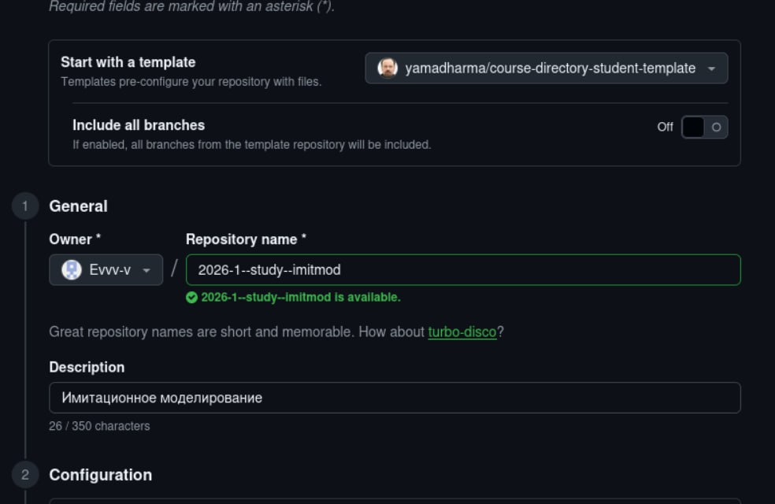{#fig-001 width=70%}

Создаем рабочий каталог и клонируем репозиторий ([рис. @fig-002]), ([рис. @fig-003]).

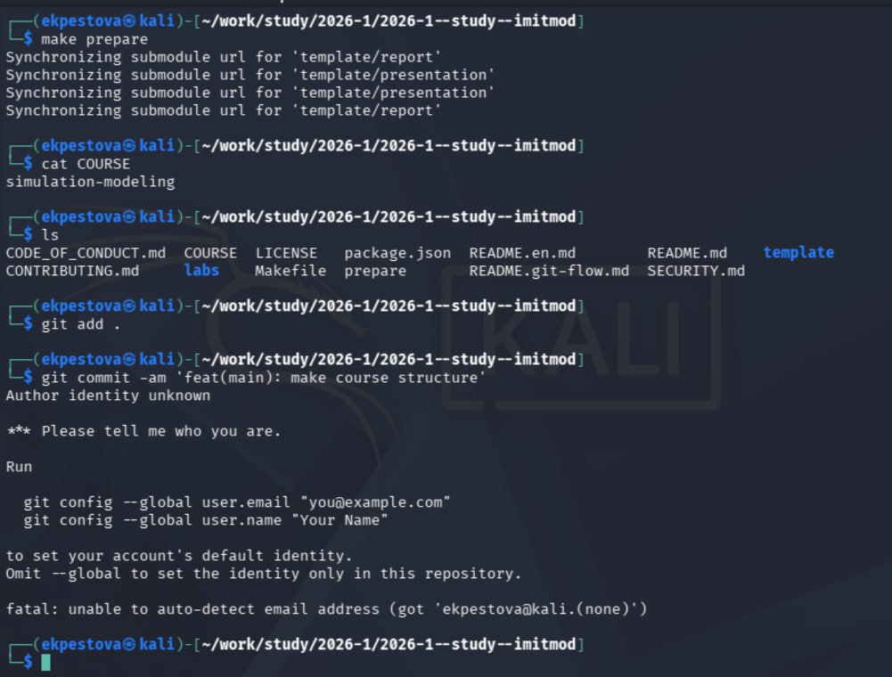{#fig-002 width=70%}
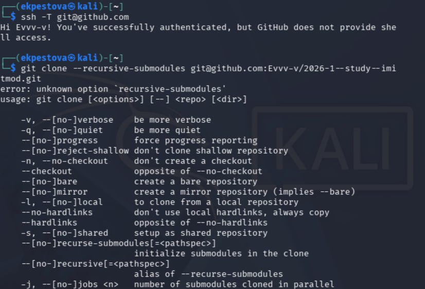{#fig-003 width=70%}

После формирования структуры курса добавляем изменения в репозиторий ([рис. @fig-004]).

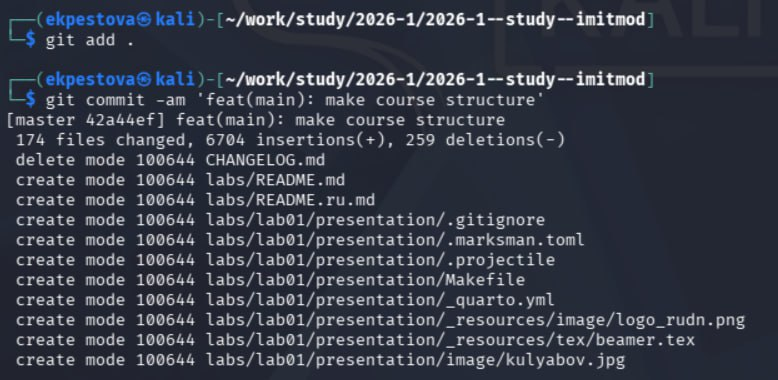{#fig-004 width=70%}

Инициализируем git flow ([рис. @fig-005]).

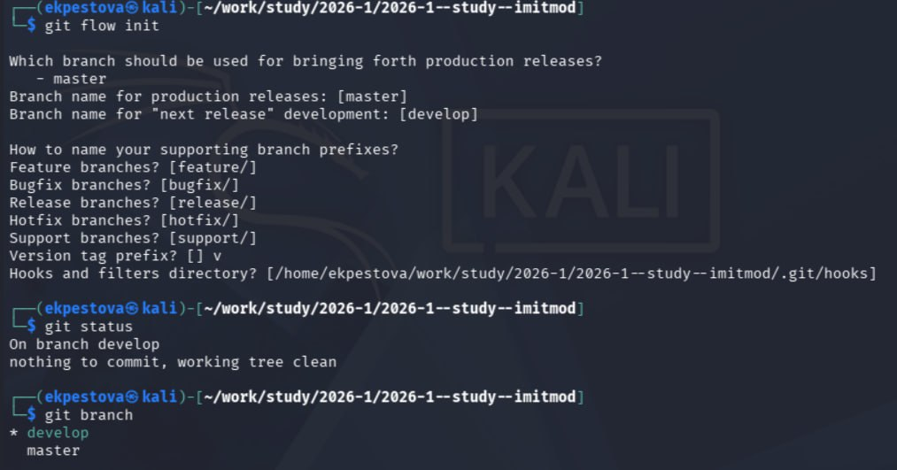{#fig-005 width=70%}

## Установка и настройка необходимых пакетов и ПО

Устанавливаем или убеждаемся в наличии пакетов, нужных для выполнения лабораторных работ: ([рис. @fig-006])  ([рис. @fig-007])  ([рис. @fig-008])

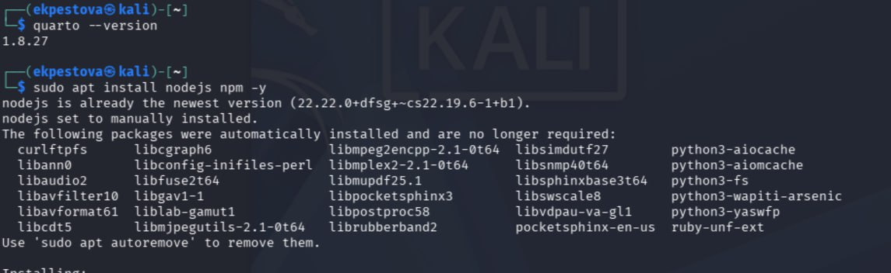{#fig-006 width=70%}

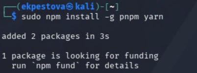{#fig-007 width=70%}

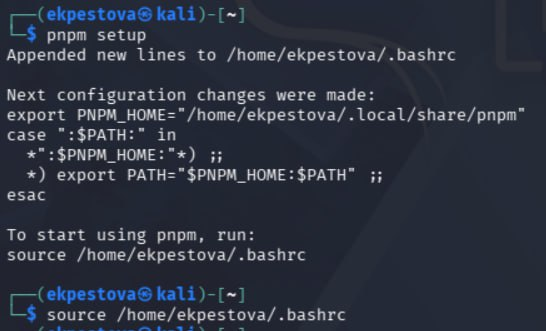{#fig-008 width=70%}

Добавим cz-customizable и standard-version ([рис. @fig-009]).

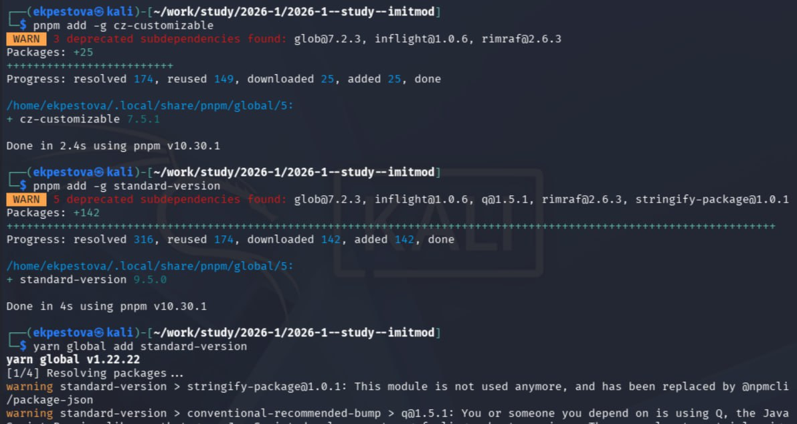{#fig-009 width=70%}

## Создание проекта DrWatson 

Создадим каталог проекта DrWatson с помощью скрипта setup_project.jl и убеждаемся в корректности структуры проекта  ([рис. @fig-010]).

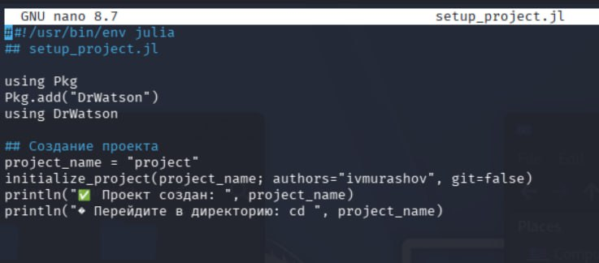{#fig-010 width=70%}

Добавим необходимые пакетов с помощью скрипта add_packages.jl и запустим скрипт ([рис. @fig-011]) ([рис. @fig-012]).

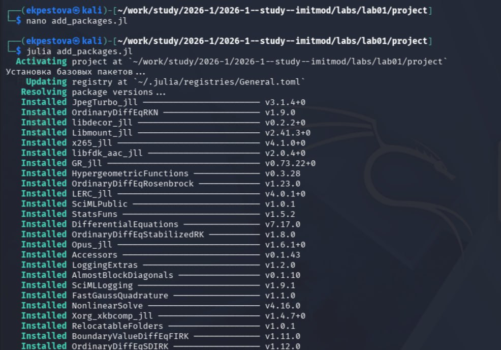{#fig-011 width=70%}

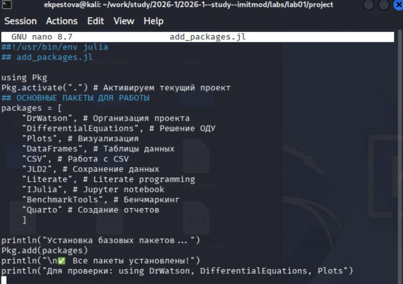{#fig-012 width=70%}





# Выводы

В ходе данной лабораторной работы мной было подготовлено рабочее пространство для выполнения программ и приобретены необходимые навыки создания и преобразования программ на Julia.
