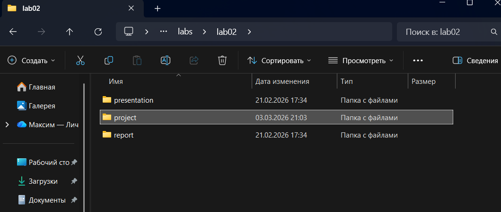
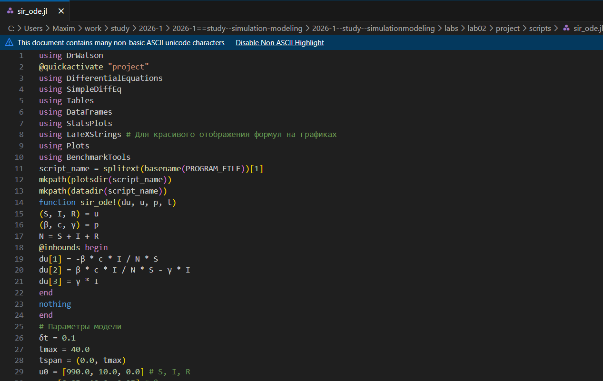
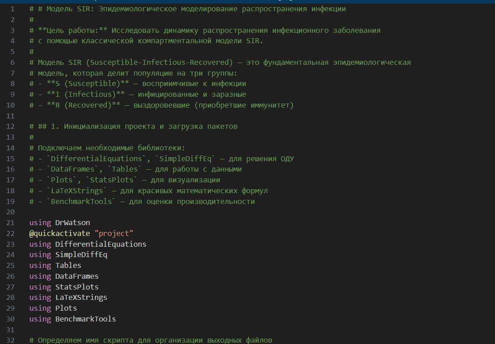
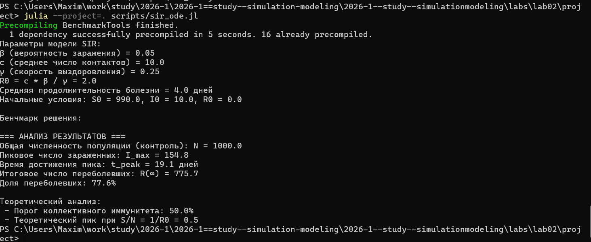
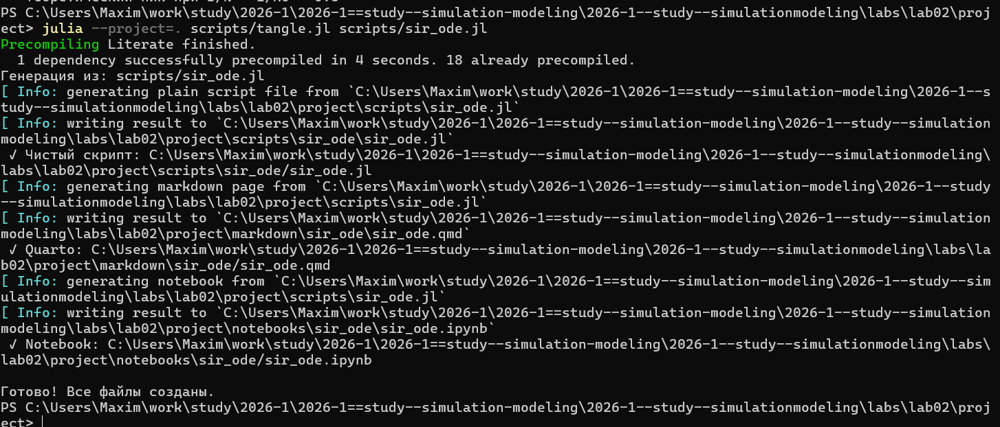
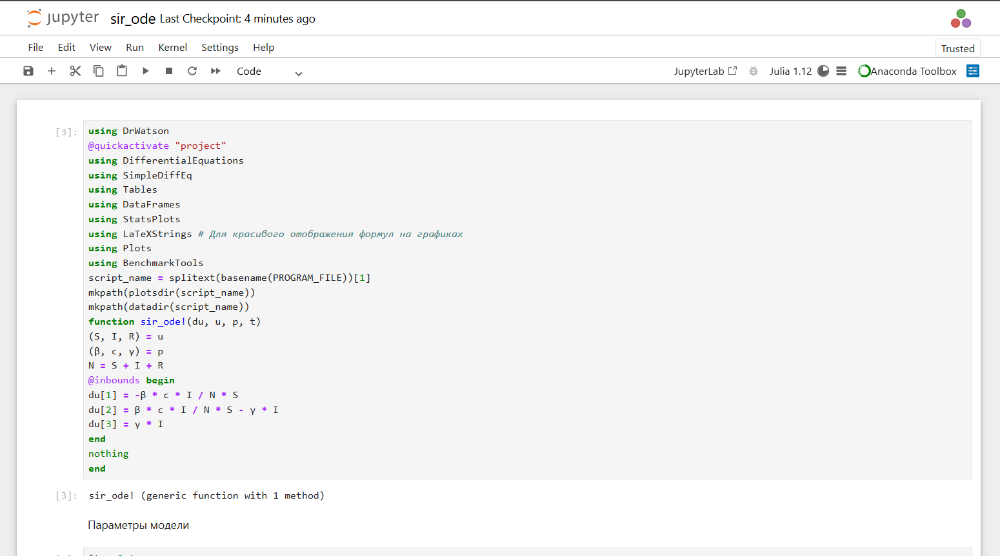
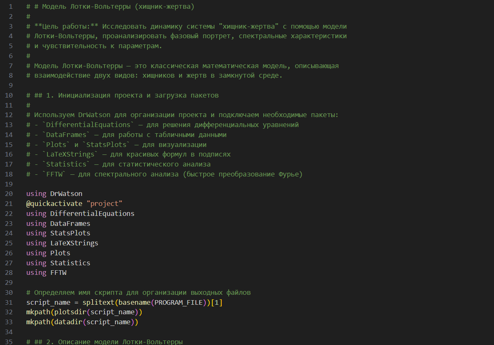
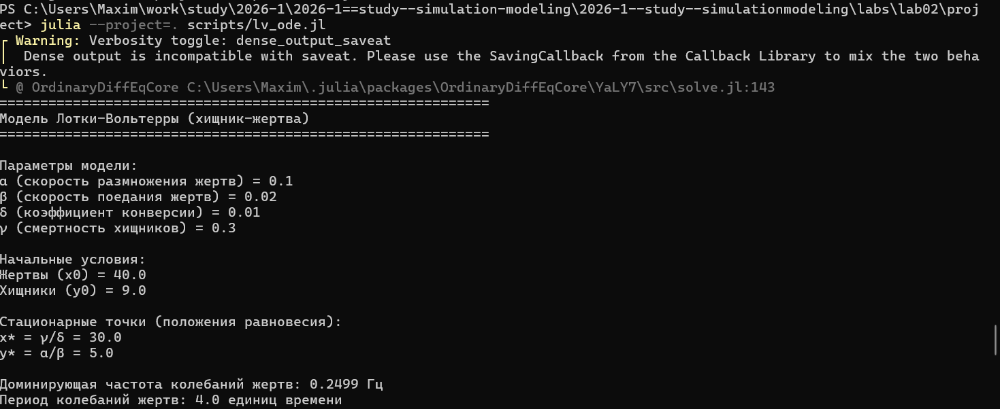
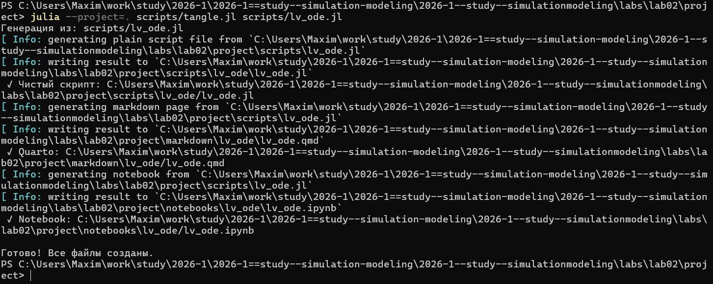
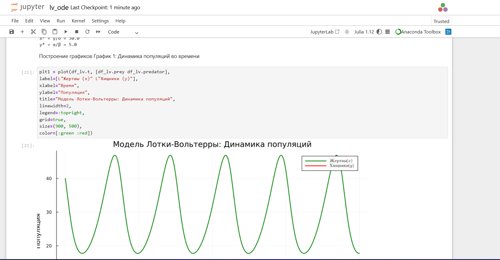

---
## Author
author:
  name: Намруев Максим Саналович
  degrees: DSc
  orcid: 0000-0002-0877-7063
  email: 1132236035@pfur.ru
  affiliation:
    - name: Российский университет дружбы народов
      country: Российская Федерация
      postal-code: 117198
      city: Москва
      address: ул. Миклухо-Маклая, д. 6

## Title
title: "Лабораторная работа №2"
subtitle: "Имитационное Моделирование"
license: "CC BY"
---

# Цель работы

Ознакомится с моделью SIR и моделью Лотки–Вольтерры [@esystem_rudn]

# Теоретическое введение

Модель Лотки-Вольтерры — это фундаментальная математическая модель в экологии, описывающая динамику взаимодействия двух видов: хищников и жертв.
Она была независимо предложена в 1920-х годах:

Модель демонстрирует, как даже простая система взаимодействий может порождать сложные колебательные режимы,
 объясняя циклические изменения численности в природных экосистемах.

Модель SIR есть классическая и фундаментальная математическая модель эпидемиологии, описывающая распространение инфекционного заболевания в закрытой популяции

Модель SIR делит всю популяцию на три взаимосвязанные группы (компартменты), что отражено в её названии:
— 𝑆 — Susceptible (Восприимчивые): люди, которые не болели, не имеют иммунитета и могут заразиться.
— 𝐼 — Infectious (Инфицированные/Заразные): люди, которые в данный момент
больны и могут передавать инфекцию.
— 𝑅 — Recovered (Выздоровевшие/Удаленные): люди, которые переболели и приобрели иммунитет (или умерли). Они больше не участвуют в процессе передачи.
Основная цель модели: не предсказать судьбу конкретного человека, а понять общую динамику эпидемии — будет ли она разрастаться, как быстро, сколько
людей в итоге переболеет, как влияют карантинные меры.

# Выполнение лабораторной работы

Создаю папку с проектом через Julia ([рис. @fig-001]).

{#fig-001 width=70%}

Создаю первый скрипт с моделью SIR ([рис. @fig-002]).

{#fig-002 width=70%}

Преобразовываю его в литературный код ([рис. @fig-003]).

{#fig-003 width=70%}

Далее запускаю скрипт с моделью ([рис. @fig-004]).

{#fig-004 width=70%}

Создаю все производные из литературного кода ([рис. @fig-005]).

{#fig-005 width=70%}

Проверяю созданый файл в юпитере и запускаю его.([рис. @fig-006]).

{#fig-006 width=70%}

Далее создаю литературный код для второго скрипта с моделью Лотки-Вольтерры ([рис. @fig-007]).

{#fig-007 width=70%}

Запускаю данную модель ([рис. @fig-008]).

{#fig-008 width=70%}

Создаю все необходимые файлы из литературного кода ([рис. @fig-009]).

{#fig-009 width=70%}

Запускаю получившийся файл в юпитере ([рис. @fig-010]).

{#fig-010 width=70%}

# Выводы

После выполения данный лабораторной работы я изучил модели SIR и Лотки–Вольтерры

# Список литературы{.unnumbered}

::: {#refs}
:::
