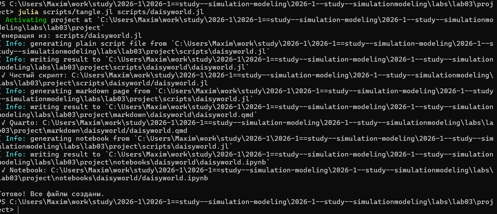
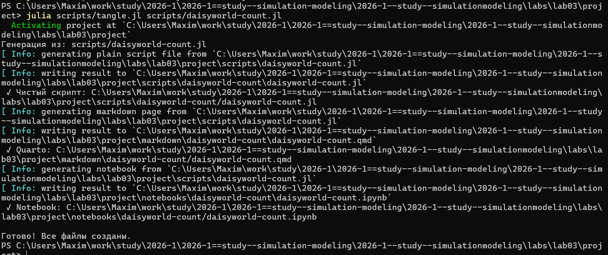
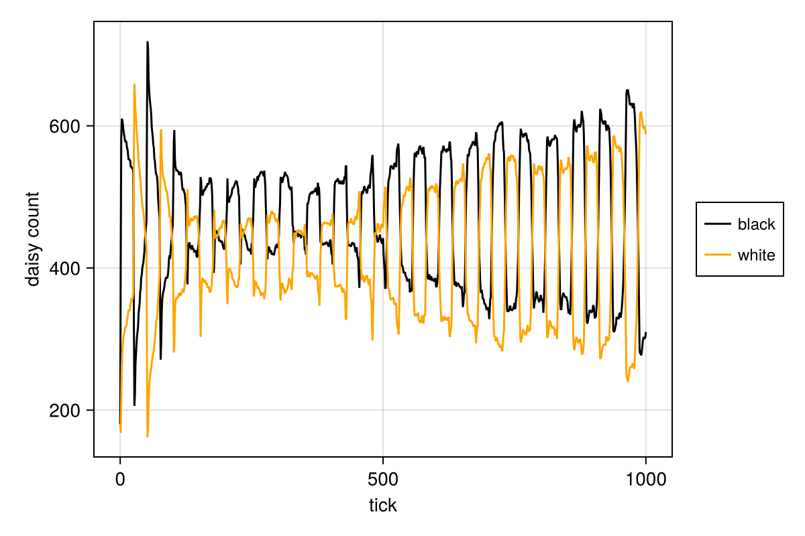
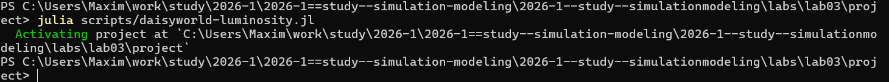
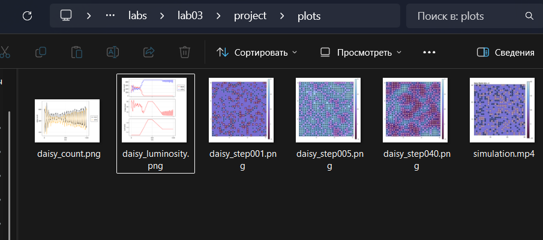
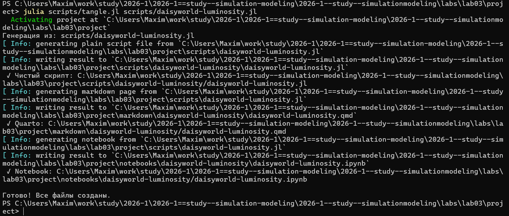
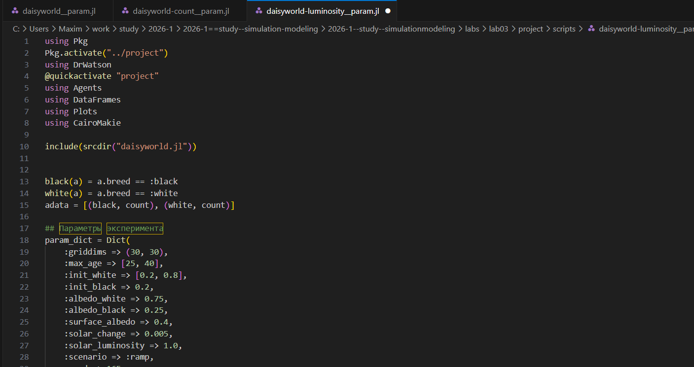
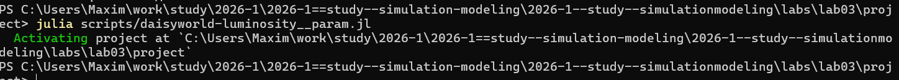
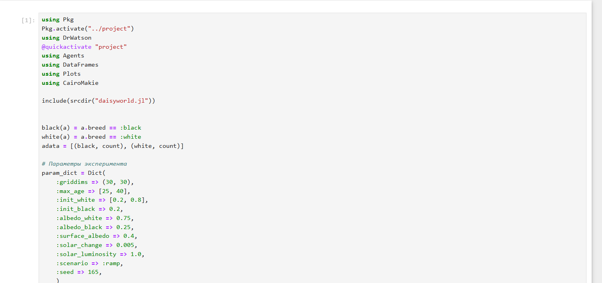

---
## Author
author:
  name: Намруев Максим Саналович
  degrees: DSc
  orcid: 0000-0002-0877-7063
  email: 1132236035@pfur.ru
  affiliation:
    - name: Российский университет дружбы народов
      country: Российская Федерация
      postal-code: 117198
      city: Москва
      address: ул. Миклухо-Маклая, д. 6
## Title
title: Лабораторная работа №3
subtitle: Имитационное моделирование
license: CC BY
date: today
date-format: "YYYY-MM-DD" # Example: 2025-09-06
---

## Цель работы

Ознакомнение с Агентным подходом к имитационному моделированию и моделью DaisyWorld.

## Выполнение лабораторной работы

Создаем файл scr/daisyworld.jl, в котором определим тип агента и функции шага модели([рис. @fig-001]).

{#fig-001 width=70%}

## Выполнение лабораторной работы

Создаем базовую визуализацию ([рис. @fig-002]).

{#fig-002 width=70%}

## Выполнение лабораторной работы

Проверяем, что после запуска скрипта у нас появились графики в папке plots([рис. @fig-003]).([рис. @fig-004]).([рис. @fig-005]).([рис. @fig-006]).

{#fig-003 width=70%}

## Выполнение лабораторной работы

{#fig-004 width=70%}

## Выполнение лабораторной работы

{#fig-005 width=70%}

## Выполнение лабораторной работы

{#fig-006 width=70%}

## Выполнение лабораторной работы

Дальше создаем все производные файлы из скрипта([рис. @fig-007]).

{#fig-007 width=70%}

## Выполнение лабораторной работы

Запускаем файл в jupyter notebook ([рис. @fig-008]).

{#fig-008 width=70%}

## Выполнение лабораторной работы

Создаю файл daisyworld-animate и запускаю его([рис. @fig-009]).

{#fig-009 width=70%}

## Выполнение лабораторной работы

После запуска у проверяю создание файла анимации ([рис. @fig-010]).

[simulation.mp4](https://rutube.ru/video/private/377765f08c5d9f89f8dd13fd00504823/?p=wr1Q4PmGmnbuPODzMvksnQ) 

## Выполнение лабораторной работы

{#fig-010 width=70%}

## Выполнение лабораторной работы

Построим график изменения числа маргариток в зависимости от модельного времени([рис. @fig-011]).

{#fig-011 width=70%}

## Выполнение лабораторной работы

Запускаем файл([рис. @fig-012]).

{#fig-012 width=70%}

## Выполнение лабораторной работы

Генерирую все производные файлы ([рис. @fig-013]).

{#fig-013 width=70%}

## Выполнение лабораторной работы

Далее запускаю notebook([рис. @fig-015]).([рис. @fig-016]).

{#fig-015 width=70%}

## Выполнение лабораторной работы

{#fig-016 width=70%}

## Выполнение лабораторной работы

Построим комплексный график изменения числа маргариток, температуры, альбедо в зависимости от модельного времени

Создаю файл daisyworld-luminosity и запускаю его([рис. @fig-017]).

{#fig-017 width=70%}

## Выполнение лабораторной работы

Проверяю создание графика димамики модели([рис. @fig-018]).

{#fig-018 width=70%}

## Выполнение лабораторной работы

Генерирую все производные файлы([рис. @fig-019]).

{#fig-019 width=70%}

## Выполнение лабораторной работы

Запускаю notebook([рис. @fig-020]).

{#fig-020 width=70%}

## Выполнение лабораторной работы

создаю файл daisy__param и запускаю его([рис. @fig-021]).([рис. @fig-022]).

{#fig-021 width=70%}

## Выполнение лабораторной работы

{#fig-022 width=70%}

## Выполнение лабораторной работы

Проверяем создание файлов([рис. @fig-023]).

{#fig-023 width=70%}

## Выполнение лабораторной работы

Создаю производные файлы и запускаю notebook([рис. @fig-024]).([рис. @fig-025]).

{#fig-024 width=70%}

## Выполнение лабораторной работы

{#fig-025 width=70%}

## Выполнение лабораторной работы

Построим график изменения числа маргариток в зависимости от модельного времени с разными параметрами модели.([рис. @fig-026]).

{#fig-026 width=70%}

## Выполнение лабораторной работы

Запускаю файл([рис. @fig-027]).

{#fig-027 width=70%}

## Выполнение лабораторной работы

Создаю все производные файлы([рис. @fig-023]).

{#fig-028 width=70%}

## Выполнение лабораторной работы

Запускаю notebook([рис. @fig-029]).

{#fig-029 width=70%}

## Выполнение лабораторной работы

Построим комплексный график изменения числа маргариток, температуры, альбедо в зависимости от модельного времени с разными параметрами модели.

Создаю файл daisyworld-luminosity__param([рис. @fig-030]).

{#fig-030 width=70%}

## Выполнение лабораторной работы

Запускаю файл([рис. @fig-031]).

{#fig-031 width=70%}

## Выполнение лабораторной работы

Запускаю notebook([рис. @fig-032]).

{#fig-032 width=70%}

## Выводы

После выполнения данной лабораторной работы мы познакомились с агентным моделированием.