---
## Author
author:
  name: Намруев Максим Саналович
  degrees: DSc
  orcid: 0000-0002-0877-7063
  email: 1132236035@pfur.ru
  affiliation:
    - name: Российский университет дружбы народов
      country: Российская Федерация
      postal-code: 117198
      city: Москва
      address: ул. Миклухо-Маклая, д. 6

## Title
title: "Отчет по лабораторной работе №3"
subtitle: "Имитационное моделирование"
license: "CC BY"
---

# Цель работы

Ознакомнение с Агентным подходом к имитационному моделированию и моделью DaisyWorld.

# Задание

— Создать рабочий каталог для кода.
— Установить необходимые пакеты.
— Выполнить предложенный код.
— Преобразовать код в литературный стиль.
— Сгенерировать из литературного кода:
— чистый код;
— jupyter notebook;
— документацию в формате Quarto.
— Выполнить код из jupyter notebook.
— Интегрировать документацию в формате Quarto в отчёт.
— Добавить в код в литературном стиле вычисление для набора параметров.
— Сгенерировать из литературного кода с параметрами:
— чистый код;
— jupyter notebook;
— документацию в формате Quarto.
— Выполнить код из jupyter notebook с параметрами.
— Интегрировать документацию с параметрами в формате Quarto в отчёт.
— Результирующие файлы не удаляйте, выложите на git.

# Теоретическое введение

## Агентный подход

Агентный подход к имитационному моделированию (Agent-Based Modeling, ABM)
— это метод исследования сложных систем, в котором поведение системы возникает из взаимодействия множества автономных сущностей, называемых агентами.
Вместо того чтобы описывать систему глобальными уравнениями, мы моделируем каждую индивидуальную единицу и правила её поведения, а затем наблюдаем,
какие коллективные паттерны появляются снизу вверх. Этот подход особенно
полезен, когда поведение системы трудно предсказать из-за нелинейностей, гетерогенности участников или адаптивных стратегий.

## Ключевые компоненты агентной модели

Любая агентная модель включает три основных элемента:
— Агенты — это активные сущности. Они обладают:
— Свойствами (атрибутами): возраст, цвет, запас ресурсов, координаты и т.п.
— Правилами поведения: как агент реагирует на изменения среды и действия
других агентов (например, перемещение, размножение, потребление).
— Целями (не обязательно): в некоторых моделях агенты стремятся максимизировать свою выгоду или выжить.
— Способностью к обучению или адаптации (в продвинутых моделях).
— Среда — это пространство, в котором существуют агенты. Она может быть:
— Дискретной (клеточная сетка, как в Daisyworld).
— Непрерывной (двумерное или трёхмерное пространство).
— Сетевой (граф социальных связей).
— Абстрактной (например, рынок без явных координат).
Среда также может иметь свои свойства (температура, ресурсы) и динамику (диффузия, обновление).
— Взаимодействия — правила, определяющие, как агенты влияют друг на друга
и на среду. Они могут быть:
— Локальными (только с соседями).
— Глобальными (все агенты взаимодействуют со всеми).
— Через среду (агенты изменяют среду, а среда влияет на агентов).

## Основные принципы агентоного моделирования

— Эмерджентность: глобальное поведение системы не закладывается явно, а возникает из локальных взаимодействий. Это позволяет открывать неожиданные
закономерности.
— Автономия: агенты действуют независимо, на основе своей внутренней логики.
— Гетерогенность: агенты могут различаться по своим характеристикам и правилам, что отражает реальное разнообразие.
— Локальность: чаще всего агенты обладают информацией только о своём ближайшем окружении

## Инструменты для агентного моделирования

В Julia основным инструментом является пакет Agents.jl [@Datseris2022],
который предоставляет гибкую инфраструктуру для создания ABM, включая различные типы пространств, 
визуализацию и сбор данных. В других языках популярны NetLogo (специализированный язык), Mesa (Python), AnyLogic и др.

## Модель Daisyworld

Модель Daisyworld, предложенная Джеймсом Лавлоком и Эндрю Уотсоном, иллюстрирует гипотезу Геи [@Wood2008; @Watson1983]. Гипотеза Геи рассматривает планету как единую,
саморегулирующуюся систему, включающую как живые, так и неживые части.
В мире маргариток произрастают чёрные и белые маргаритки. Их альбедо различается: чёрные маргаритки поглощают свет и тепло, нагревая окружающую
среду; белые маргаритки делают наоборот. Маргаритки могут размножаться только в определённом температурном диапазоне, а это значит, что слишком много
(или слишком мало) тепла от солнца и/или окружающей среды в конечном итоге
остановит их размножение.
Поверхность Геи нагревается солнцем, но растущие на ней маргаритки поглощают
или отражают свет звёзд, изменяя локальную температуру.
Если температура становится слишком высокой или слишком низкой, маргаритки
не захотят размножаться. Пока температура благоприятна, маргаритки конкурируют за землю и пытаются дать начало новому растению в местах, расположенных
неподалёку от них.
Когда климат слишком холодный, черным маргариткам необходимо размножаться, чтобы повысить температуру, и наоборот — когда климат слишком теплый,
необходимо производить больше белых маргариток, чтобы охладить климат.
Взаимодействие живых и неживых аспектов этого мира находит равновесие в
широком диапазоне параметров, хотя при достаточно сильном внешнем воздействии маргаритки не смогут регулировать температуру планеты и в конечном
итоге вымрут.

## Описание модели Daisyworld

В модели Daisyworld агентами являются чёрные и белые маргаритки. Они живут
на клеточной сетке (среда).
Свойства агентов: вид и возраст.
Правила:
— Маргаритки изменяют локальную температуру за счёт разного альбедо.
— Температура влияет на вероятность размножения (чем ближе к оптимуму, тем
выше шанс заселить соседнюю пустую клетку).
— Агенты стареют и умирают после определённого возраста.
— Среда (температура) диффундирует между клетками.

# Выполнение лабораторной работы

## Реализация на Agents.jl

Создаем файл scr/daisyworld.jl, в котором определим тип агента и функции шага модели([рис. @fig-001]).

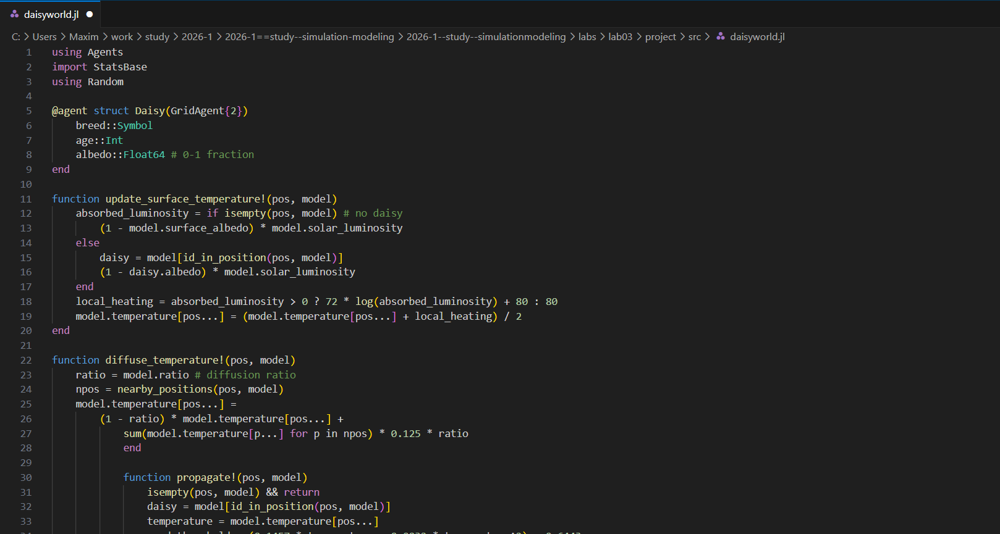{#fig-001 width=70%}

## Базовая визуализация

Создаем базовую визуализацию ([рис. @fig-002]).

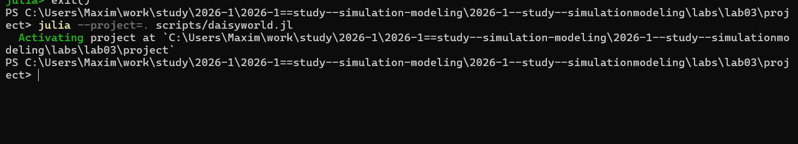{#fig-002 width=70%}



Проверяем, что после запуска скрипта у нас появились графики в папке plots([рис. @fig-003]).([рис. @fig-004]).([рис. @fig-005]).([рис. @fig-006]).

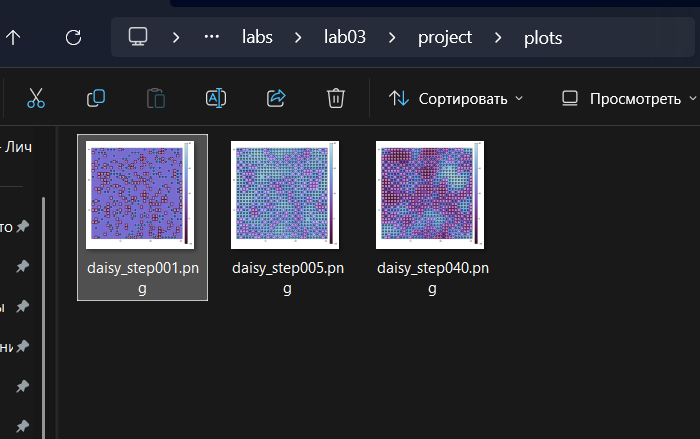{#fig-003 width=70%}

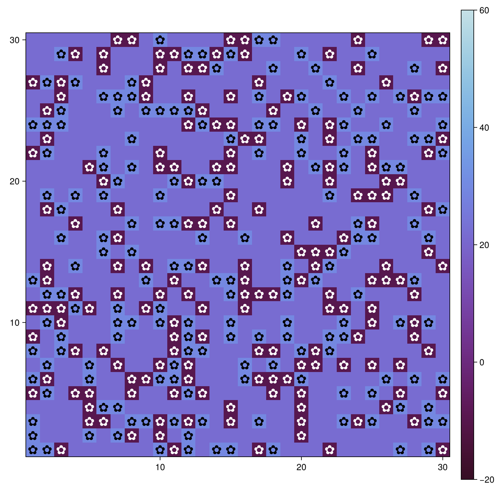{#fig-004 width=70%}

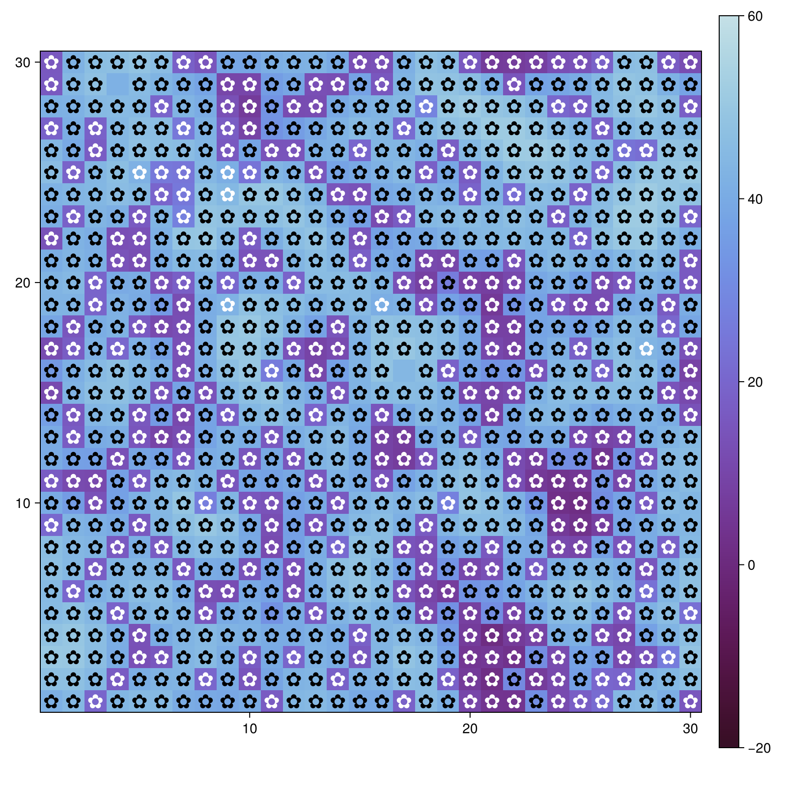{#fig-005 width=70%}

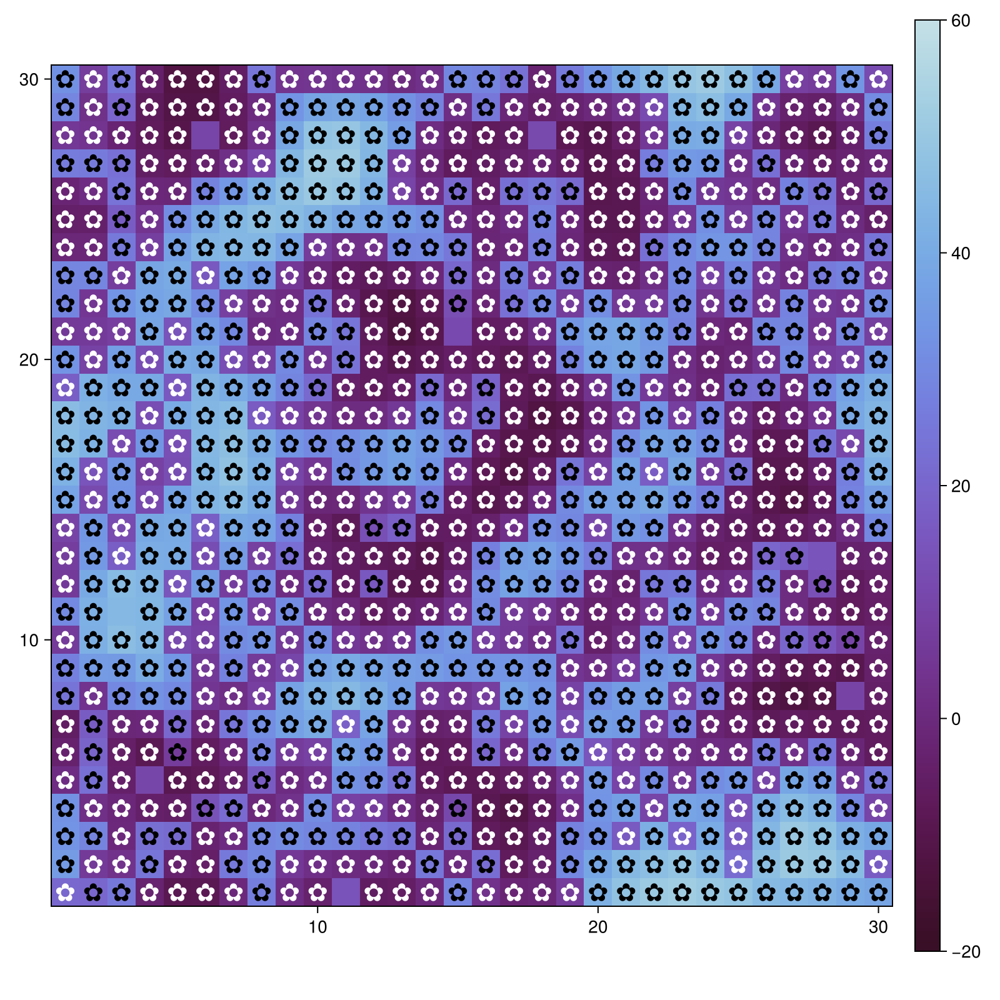{#fig-006 width=70%}

Дальше создаем все производные файлы из скрипта([рис. @fig-007]).

{#fig-007 width=70%}

Запускаем файл в jupyter notebook ([рис. @fig-008]).

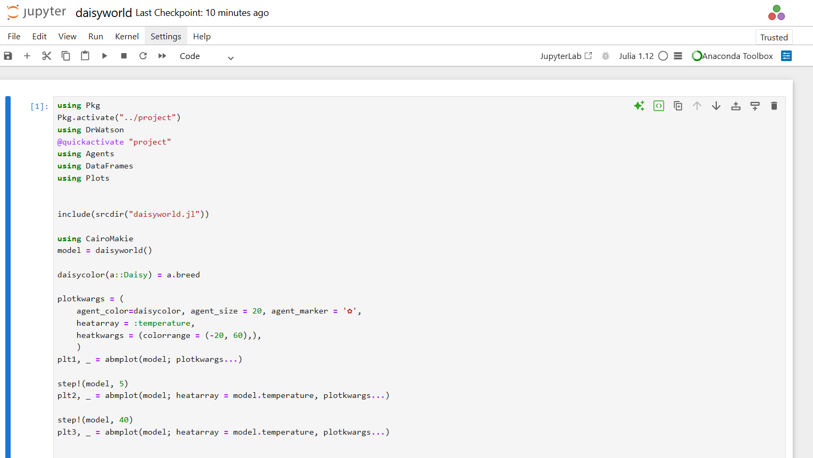{#fig-008 width=70%}

## Анимация модели

Создаю файл daisyworld-animate и запускаю его([рис. @fig-009]).

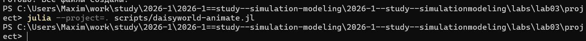{#fig-009 width=70%}

После запуска у проверяю создание файла анимации ([рис. @fig-010]).

[simulation.mp4](https://rutube.ru/video/private/377765f08c5d9f89f8dd13fd00504823/?p=wr1Q4PmGmnbuPODzMvksnQ) 

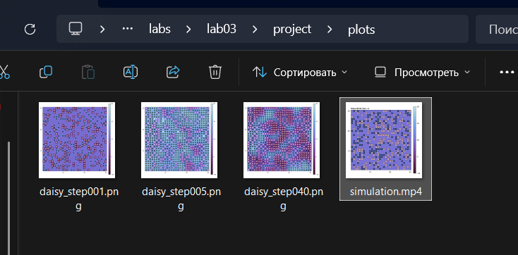{#fig-010 width=70%}

## Динамика числа маргариток

Построим график изменения числа маргариток в зависимости от модельного времени([рис. @fig-011]).

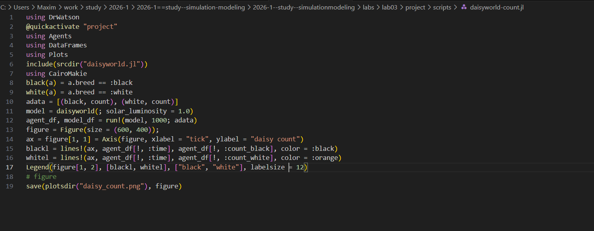{#fig-011 width=70%}



Запускаем файл([рис. @fig-012]).

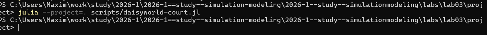{#fig-012 width=70%}

Генерирую все производные файлы ([рис. @fig-013]).

{#fig-013 width=70%}

Далее запускаю notebook([рис. @fig-015]).([рис. @fig-016]).

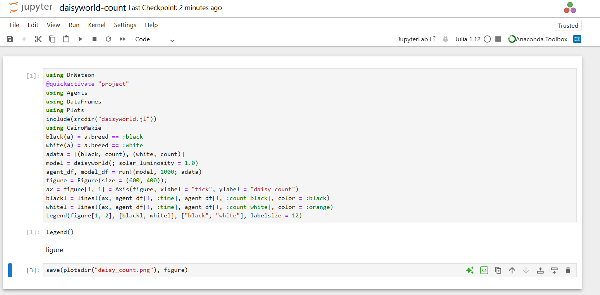{#fig-015 width=70%}

{#fig-016 width=70%}

## Динамика модели

Построим комплексный график изменения числа маргариток, температуры, альбедо в зависимости от модельного времени

Создаю файл daisyworld-luminosity и запускаю его([рис. @fig-017]).

{#fig-017 width=70%}



Проверяю создание графика димамики модели([рис. @fig-018]).

{#fig-018 width=70%}

Генерирую все производные файлы([рис. @fig-019]).

{#fig-019 width=70%}

Запускаю notebook([рис. @fig-020]).

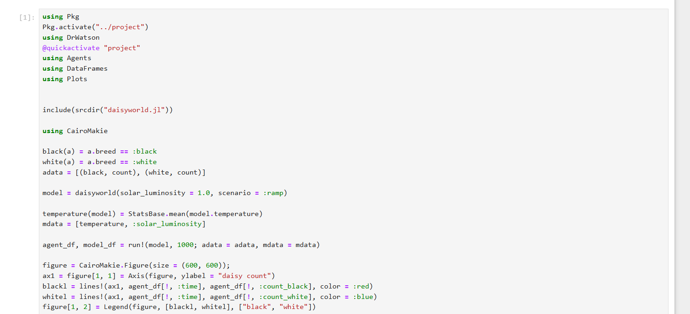{#fig-020 width=70%}

## Базовая визуализация(параметры)

создаю файл daisy__param и запускаю его([рис. @fig-021]).([рис. @fig-022]).

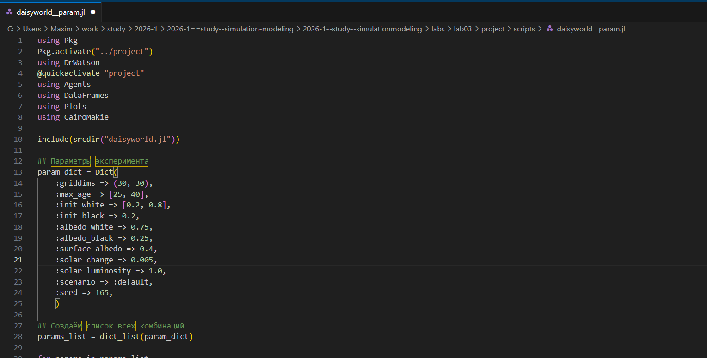{#fig-021 width=70%}

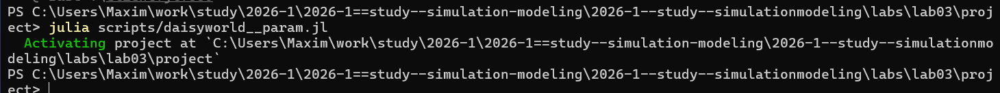{#fig-022 width=70%}



Проверяем создание файлов([рис. @fig-023]).

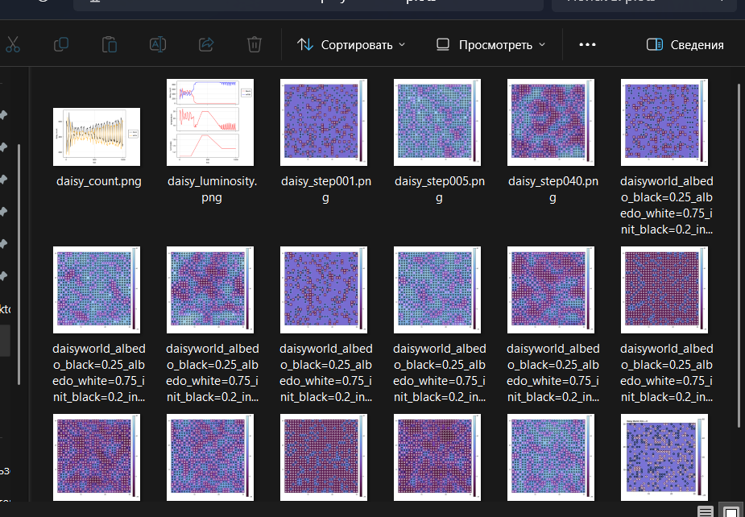{#fig-023 width=70%}

Создаю производные файлы и запускаю notebook([рис. @fig-024]).([рис. @fig-025]).

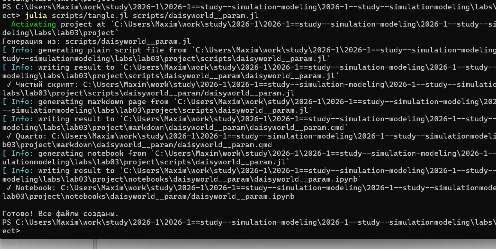{#fig-024 width=70%}

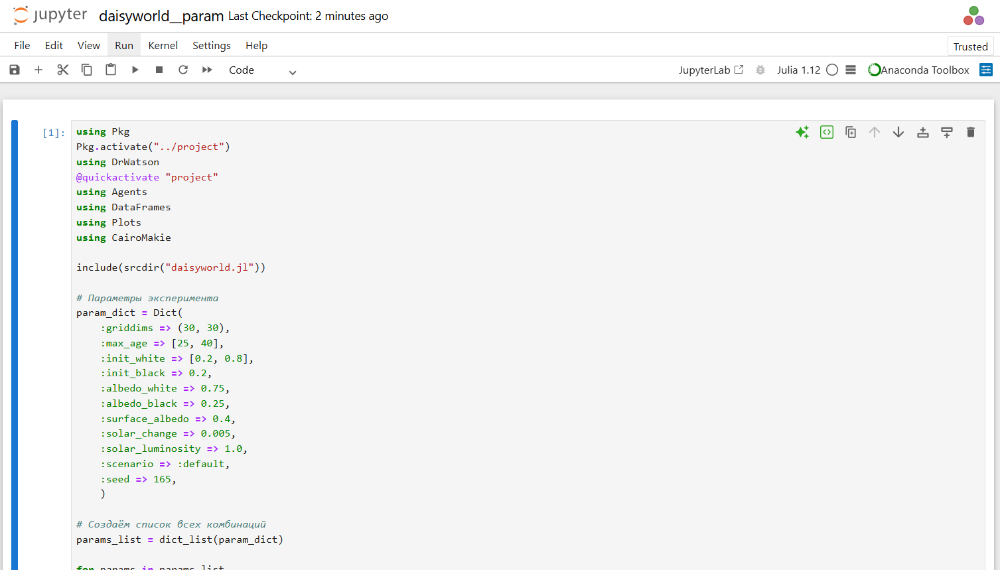{#fig-025 width=70%}

## Динамика числа маргариток(параметры)

Построим график изменения числа маргариток в зависимости от модельного времени с разными параметрами модели.([рис. @fig-026]).

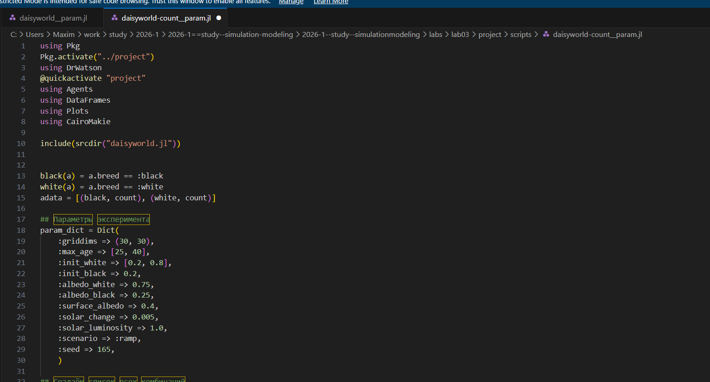{#fig-026 width=70%}



Запускаю файл([рис. @fig-027]).

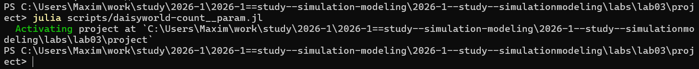{#fig-027 width=70%}

Создаю все производные файлы([рис. @fig-023]).

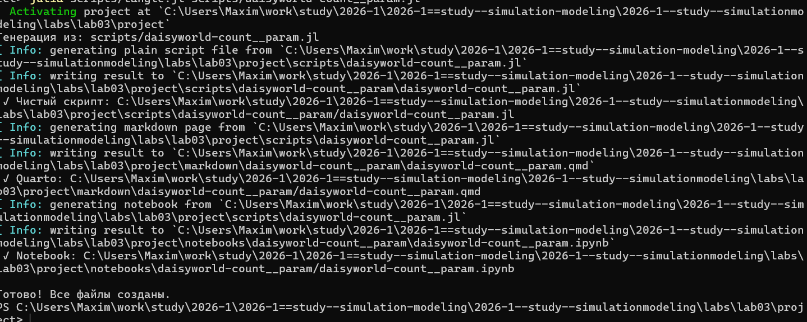{#fig-028 width=70%}

Запускаю notebook([рис. @fig-029]).

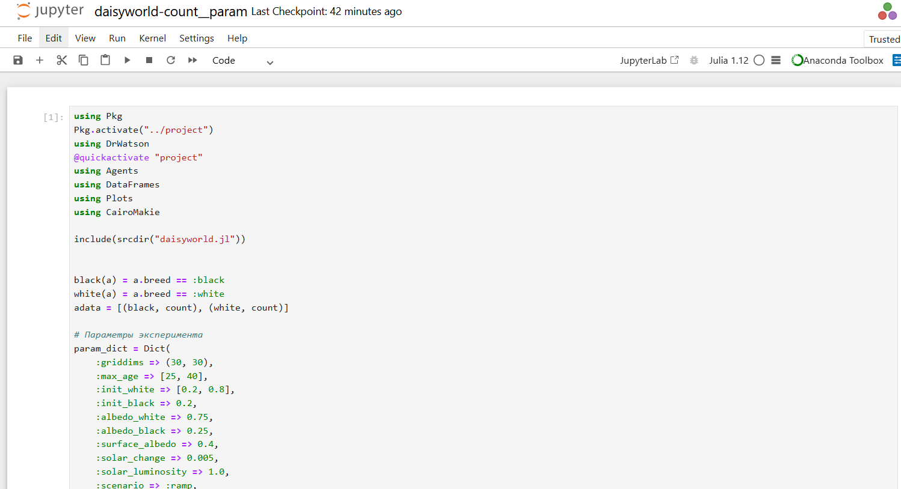{#fig-029 width=70%}

## Динамика модели(параметры)

Построим комплексный график изменения числа маргариток, температуры, альбедо в зависимости от модельного времени с разными параметрами модели.

Создаю файл daisyworld-luminosity__param([рис. @fig-030]).

{#fig-030 width=70%}



Запускаю файл([рис. @fig-031]).

{#fig-031 width=70%}

Запускаю notebook([рис. @fig-032]).

{#fig-032 width=70%}

# Выводы

После выполнения данной лабораторной работы мы познакомились с агентным моделированием.

# Список литературы{.unnumbered}

::: {#refs}
:::
