---
## Author
author:
  name: Намруев Максим Саналович
  degrees: DSc
  orcid: 0000-0002-0877-7063
  email: 1132236035@pfur.ru
  affiliation:
    - name: Российский университет дружбы народов
      country: Российская Федерация
      postal-code: 117198
      city: Москва
      address: ул. Миклухо-Маклая, д. 6
## Title
title: Лабораторная работа №4
subtitle: Имитационное моделирование
license: CC BY
date: today
date-format: "YYYY-MM-DD" # Example: 2025-09-06
---

## Цель работы

Создадим агентную модель распространения инфекционного заболевания на
основе классической компартментальной модели SIR (Susceptible-InfectiousRecovered). Модель будет реализована с использованием пакета Agents.jl. В отличие от классической модели на дифференциальных уравнениях, агентный
подход позволит учесть индивидуальные характеристики, пространственную
структуру и стохастичность процессов.

## Задание

— Создать рабочий каталог для кода.
— Установить необходимые пакеты.
— Выполнить предложенный код.
— Преобразовать код в литературный стиль.
— Сгенерировать из литературного кода:
— чистый код;
— jupyter notebook;
— документацию в формате Quarto.
— Выполнить код из jupyter notebook.
— Интегрировать документацию в формате Quarto в отчёт.
— Добавить в код в литературном стиле вычисление для набора параметров.
— Сгенерировать из литературного кода с параметрами:
— чистый код;
— jupyter notebook;
— документацию в формате Quarto.
— Выполнить код из jupyter notebook с параметрами.
— Интегрировать документацию с параметрами в формате Quarto в отчёт.

## Теоретическое введение

## Классическая модель SIR

Модель SIR, предложенная Кермаком и Маккендриком в 1927 году, описывает
динамику эпидемии в популяции, разделённой на три группы:
— 𝑆 (Susceptible) — восприимчивые к заболеванию индивиды;
— 𝐼 (Infectious) — инфицированные, способные заражать восприимчивых;
— 𝑅 (Recovered) — выздоровевшие (или умершие), получившие иммунитет и более

## Ограничения классического подхода

Несмотря на широкое применение, модель на ОДУ имеет ряд ограничений:
— Однородность популяции — все индивиды считаются одинаковыми.
— Отсутствие пространственной структуры — предполагается полное перемешивание.
— Детерминированность — не учитываются случайные флуктуации.
— Непрерывность — количество людей рассматривается как непрерывная величина.

## Преимущества агентного подхода

Несмотря на широкое применение, модель на ОДУ имеет ряд ограничений:
— Однородность популяции — все индивиды считаются одинаковыми.
— Отсутствие пространственной структуры — предполагается полное перемешивание.
— Детерминированность — не учитываются случайные флуктуации.
— Непрерывность — количество людей рассматривается как непрерывная величина.

## Агенты

Каждый агент — человек, обладающий следующими свойствами:
— status::Symbol — состояние (:S, :I, :R);
— days_infected::Int — количество дней с момента заражения (для инфицированных).

## Пространство состояний

Агенты размещаются на графе, где узлы представляют локации (города, районы), а рёбра — возможные перемещения между ними. Такой подход позволяет
моделировать метапопуляционную динамику и миграцию.

## Параметры модели

— Ns — вектор численности населения по локациям;
— β_und — вероятность передачи для невыявленных случаев;
— β_det — вероятность передачи для выявленных случаев;
— infection_period — длительность заболевания (дней);
— detection_time — время до выявления заболевания;
— death_rate — вероятность летального исхода;
— reinfection_probability — вероятность повторного заражения;
— migration_rates — матрица вероятностей миграции между локациями.

## Динамика 

На каждом шаге (соответствует одному дню) для каждого агента выполняются
следующие процессы :
— Миграция — агент может переместиться в другую локацию с вероятностью,
заданной матрицей migration_rates.
— Передача инфекции — если агент инфицирован, он может заразить восприимчивых агентов в той же локации. Количество заражённых за день определяется
пуассоновским процессом с интенсивностью, зависящей от статуса выявления
(β_und или β_det).
— Обновление счётчика — для инфицированных увеличивается days_infected.
— Выздоровление или смерть — если days_infected достиг infection_period,
агент либо выздоравливает (переходит в R), либо умирает (удаляется из модели)
с вероятностью death_rate. Выздоровевшие могут быть повторно инфицированы с вероятностью reinfection_probability.

## Код модели

Создаю скрипт модели, который будет использоваться как основа для дальнейшей работы ([рис. @fig-001]).

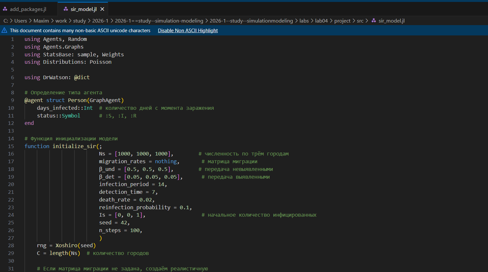{#fig-001 width=70%}

## Базовый эксперимент

Далее создаю и запускаю скрипт с базовым экспериментом, который запускает один эксперимент с фиксированными параметрами и сохраняет динамику численности агентов.([рис. @fig-002]).

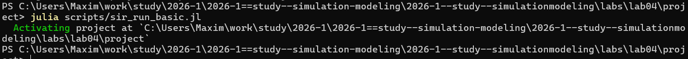{#fig-002 width=70%}

## Базовый эксперимент

Создаю все производные форматы([рис. @fig-003]).

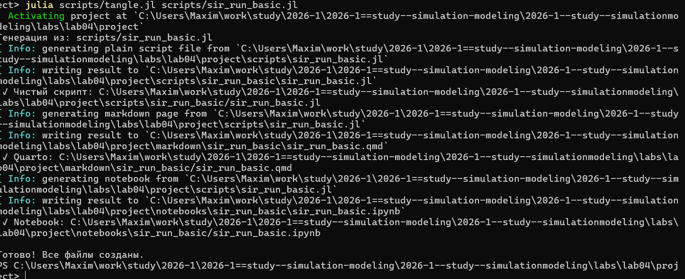{#fig-003 width=70%}

## Базовый эксперимент

Запускаю jupyter notebook([рис. @fig-004]).

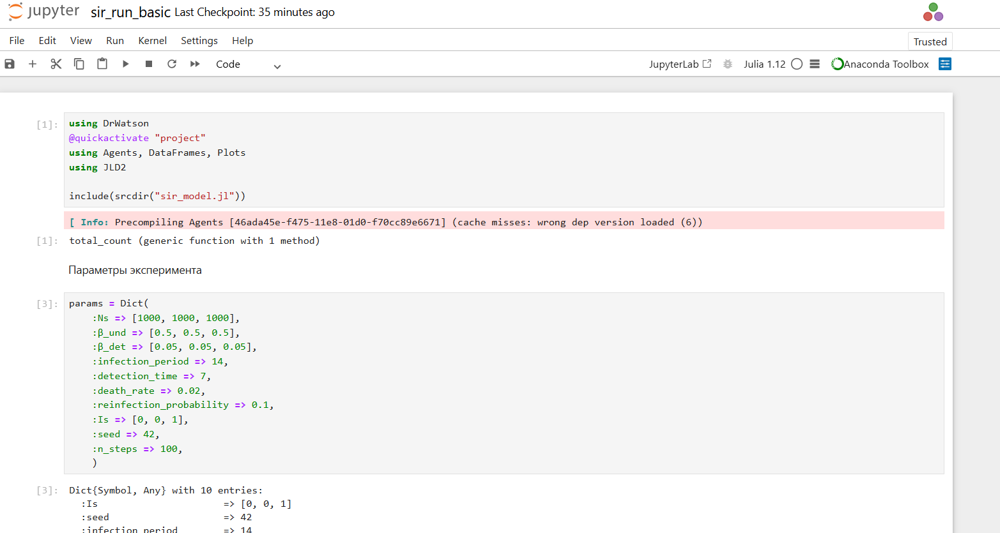{#fig-004 width=70%}

## Базовый эксперимент

Получаем следующий график([рис. @fig-005]).

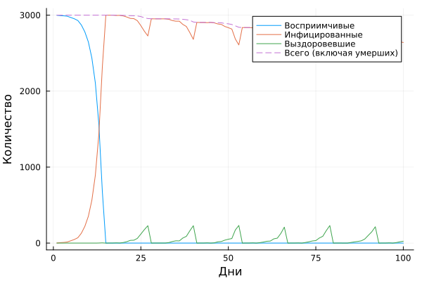{#fig-005 width=70%}

## Сканирование коэффициента заразности

Создаю сприпт, который исследует, как изменение базовой заразности влияет на эпидемические показатели([рис. @fig-006]).

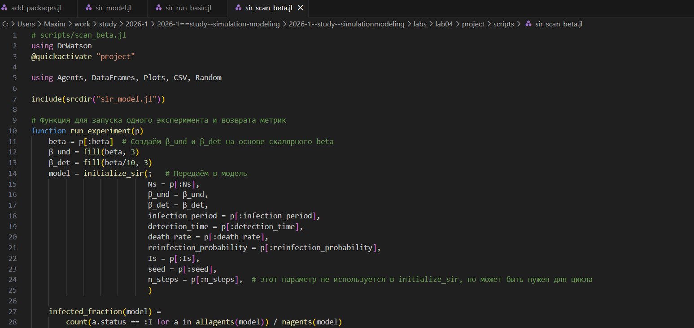{#fig-006 width=70%}

## Сканирование коэффициента заразности

Запускаю данный сприпт([рис. @fig-007]).

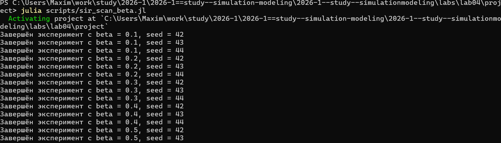{#fig-007 width=70%}

## Сканирование коэффициента заразности

Проверяю создание .csv файла с результатами([рис. @fig-008]).

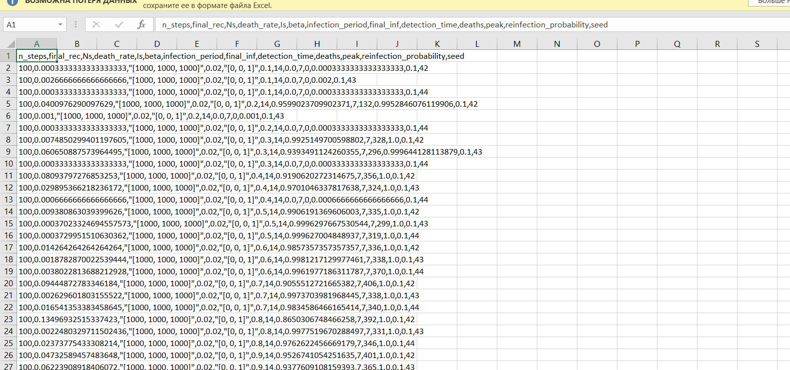{#fig-008 width=70%}

## Сканирование коэффициента заразности

Создаю производные файлы([рис. @fig-009]).

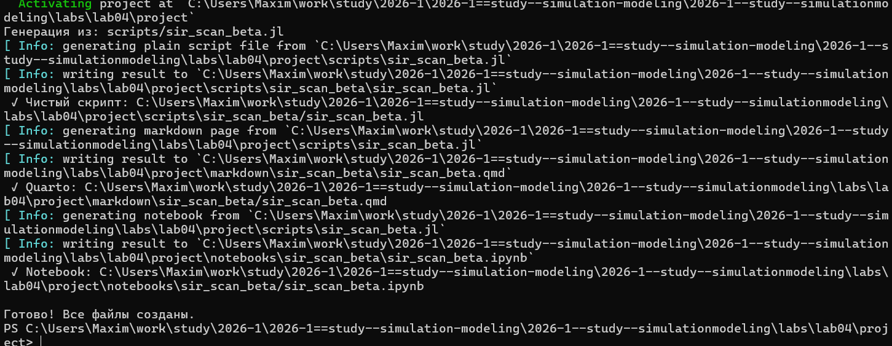{#fig-009 width=70%}

## Сканирование коэффициента заразности

Запускаю ноутбук([рис. @fig-010]).

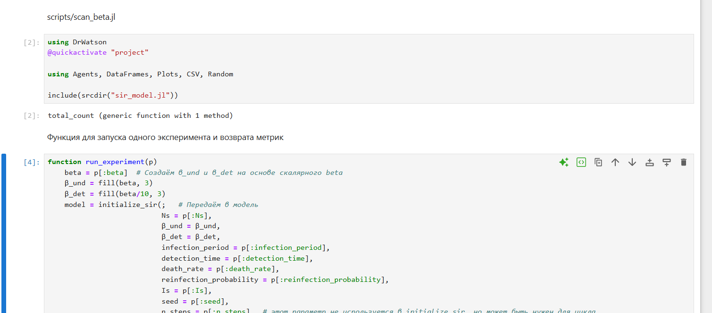{#fig-010 width=70%}

## Сканирование коэффициента заразности

После запуска сприпта получился следующий график([рис. @fig-011]).

{#fig-011 width=70%}

## Исследование эффекта миграции

Создаю сприпт, который исследует, как эффективность перемещения людей между городами влияет на скорость распространения эпидемии и масштаб пика([рис. @fig-012]).

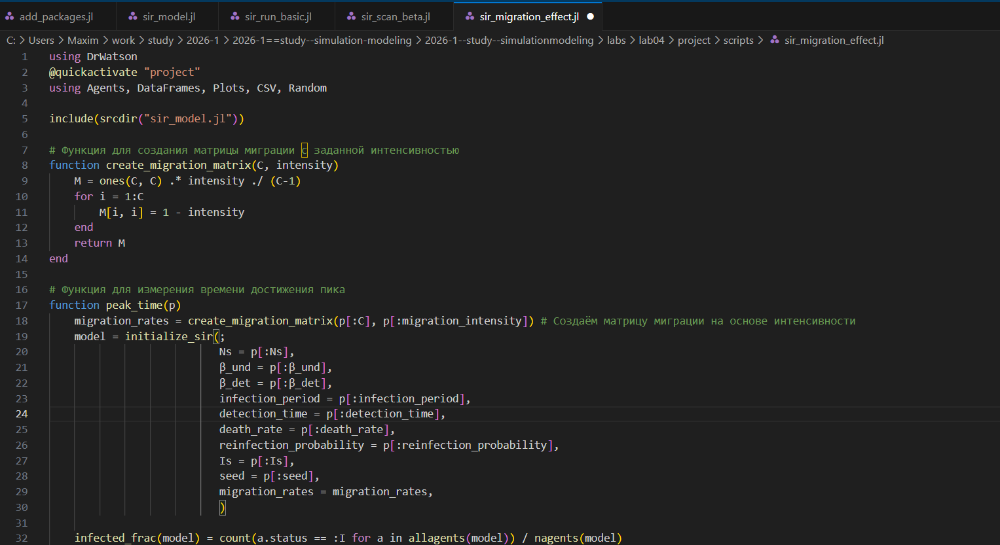{#fig-012 width=70%}

## Исследование эффекта миграции

Запускаю данный скрипт([рис. @fig-013]).

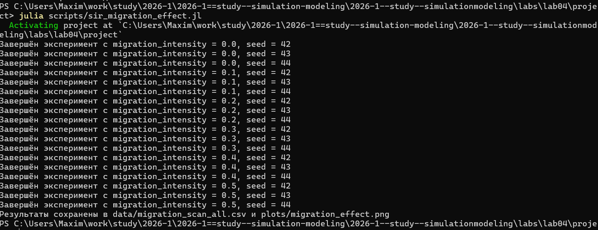{#fig-013 width=70%}

## Исследование эффекта миграции

Проверяю наличия файла csv с результатами скрипта([рис. @fig-014]).

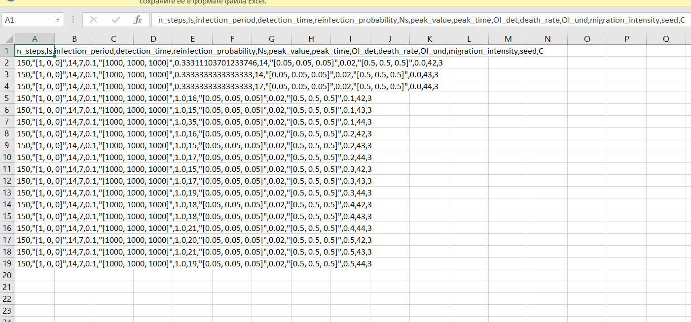{#fig-014 width=70%}

## Исследование эффекта миграции

Создаю все производные форматы([рис. @fig-015]).

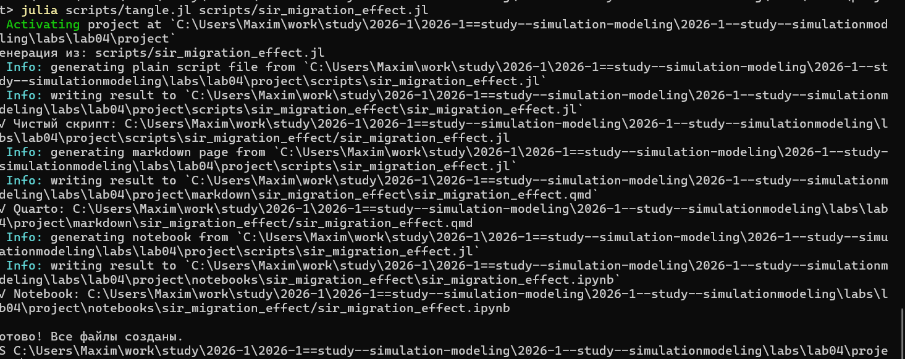{#fig-015 width=70%}

## Исследование эффекта миграции

Запускаю файл ноутбук([рис. @fig-016]).

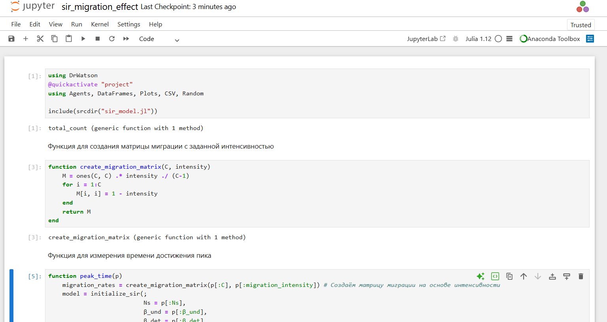{#fig-016 width=70%}

## Исследование эффекта миграции

Получаю следующий график([рис. @fig-017]).

{#fig-017 width=70%}

## Многокритериальная опитимизация параметров

Создаю и запускаю скрипт, который ищет оптимальные комбинации параметров, минимизирующие одновременно два критерия: пиковую заболеваемоть и долю умерших([рис. @fig-018]).

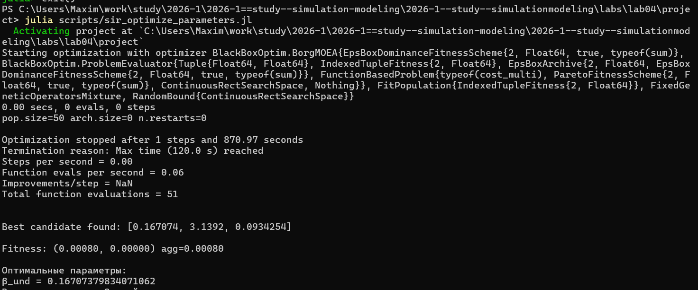{#fig-018 width=70%}

## Многокритериальная опитимизация параметров

Создаю все производные форматы([рис. @fig-019]).

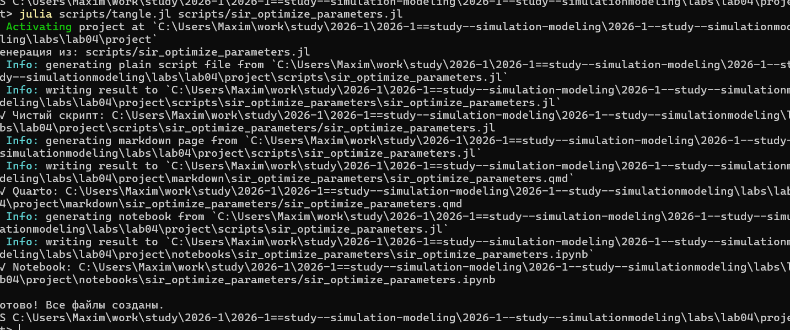{#fig-019 width=70%}

## Многокритериальная опитимизация параметров

Запускаю ноутбук([рис. @fig-020]).

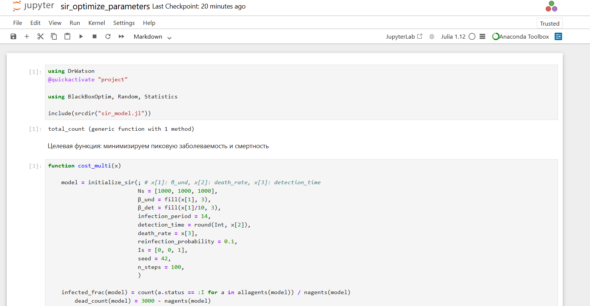{#fig-020 width=70%}

## Сводная визуализация результатов

Создаю и запускаю скрипт, который загружает результаты параметрического сканирования и строит едный составной график, объединяющий три панели([рис. @fig-021]).

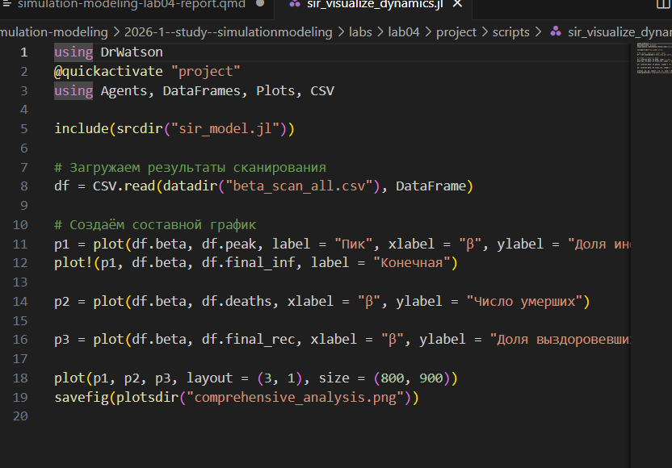{#fig-021 width=70%}

## Сводная визуализация результатов

Создаю все производные форматы([рис. @fig-022]).

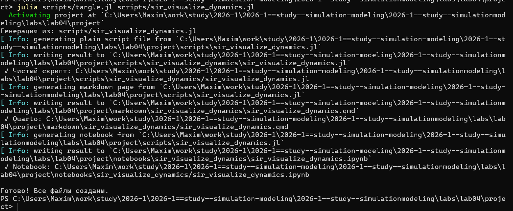{#fig-022 width=70%}

## Сводная визуализация результатов

Зарускаю ноутбук ([рис. @fig-023]).

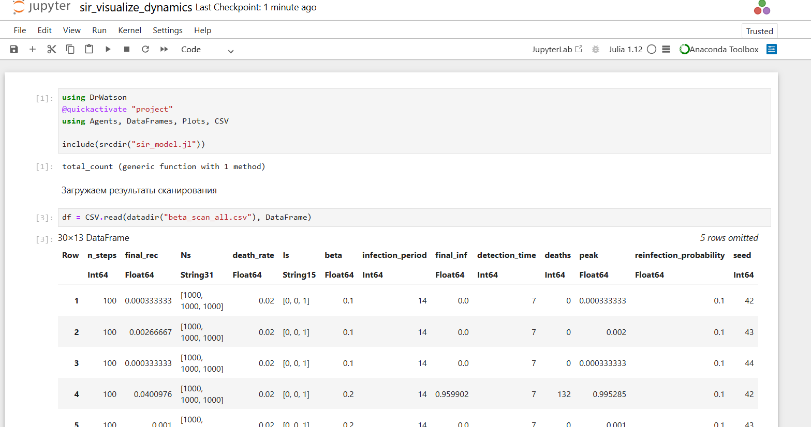{#fig-023 width=70%}

## Сводная визуализация результатов

В резульате получаю следующий график([рис. @fig-024]).

{#fig-024 width=70%}

## Выводы

После выполения данной лабораторной работы мы создали эпидемическую модель sir через агентный подход
