---
## Author
author:
  name: Намруев Максим Саналович
  degrees: DSc
  orcid: 0000-0002-0877-7063
  email: 1132236035@pfur.ru
  affiliation:
    - name: Российский университет дружбы народов
      country: Российская Федерация
      postal-code: 117198
      city: Москва
      address: ул. Миклухо-Маклая, д. 6
## Title
title: Лабораторная работа №5
subtitle: Имитационное моделирование
license: CC BY
date: today
date-format: "YYYY-MM-DD" # Example: 2025-09-06
---

## Цель работы

— Построить сеть Петри для пяти философов, моделируя захват и освобождение
вилок.
— Обнаружить состояние взаимной блокировки (deadlock), когда каждый философ взял одну вилку и ждёт вторую.
— Провести имитационное моделирование (стохастическое и детерминированное) и выявить наличие deadlock.
— Модифицировать сеть, чтобы предотвратить deadlock.
— Проанализировать результаты и оформить отчёт с графиками и анимацией.

## Задание

— Создать рабочий каталог для кода.
— Установить необходимые пакеты.
— Выполнить предложенный код.
— Преобразовать код в литературный стиль.
— Сгенерировать из литературного кода:
— чистый код;
— jupyter notebook;
— документацию в формате Quarto.
— Выполнить код из jupyter notebook.
— Интегрировать документацию в формате Quarto в отчёт.
— Добавить в код в литературном стиле вычисление для набора параметров.
— Сгенерировать из литературного кода с параметрами:
— чистый код;
— jupyter notebook;
— документацию в формате Quarto.
— Выполнить код из jupyter notebook с параметрами.
— Интегрировать документацию с параметрами в формате Quarto в отчёт.

## История создания

Первую идею сетей Петри Карл Адам Петри сформулировал в возрасте 13 лет
для описания химических реакций. Официальной датой рождения теории считается 1962 год, когда он защитил докторскую диссертацию «Kommunikation mit
Automaten» («Взаимодействие с автоматами») в Боннском университете. За свою
работу он получил премию Тьюринга (ACM Turing Award) — высшую награду в
области информатики

## Общая информация

Сеть Петри есть математический аппарат для моделирования дискретных систем.
Графически она представляется как двудольный ориентированный граф двух
типов вершин: позиции (круги) и переходы (прямоугольники).
— Позиции (Places) суть пассивные элементы, описывающие состояние системы
(например, наличие ресурса или выполнение условия).
— Внутри позиции могут находиться фишки (tokens) — неотрицательное целое
число, указывающее на количество ресурсов.
— Переходы (Transitions) суть активные элементы, описывающие события или
действия системы.
— Они могут срабатывать, изменяя состояние модели.
— Дуги (Arcs) суть направленные соединения между позициями и переходами
(но не между двумя позициями или двумя переходами), которые показывают,
как состояние влияет на события и наоборот.
— Маркировка (Marking) есть распределение фишек по позициям в определённый момент времени, то есть текущее состояние модели.
— Смена маркировок происходит при срабатывании переходов в соответствии
с определёнными правилами.

## Общая информация

Теория сетей Петри, появившаяся как инструмент для анализа химических процессов, сегодня является мощным и наглядным математическим аппаратом. Она
незаменима везде, где нужно описать параллельные, асинхронные и распределённые системы. В её основе лежат всего четыре элемента, а богатство поведения
возникает из их комбинации.

## Свойства

Сети Петри используются не просто для моделирования, но и для проверки корректности системы. Для этого исследуются её важнейшие свойства:
— Ограниченность (Boundedness). Количество фишек в любой позиции сети никогда не превысит некоторого заданного предела K. Если 𝐾 = 1, сеть называется
безопасной.
— Активность (Liveness). Для любого перехода всегда существует достижимая
маркировка, в которой он может сработать. Это гарантирует, что в системе не
будет вечных блокировок.
— Достижимость (Reachability). Можно ли из начальной маркировки 𝑀0 попасть
в некоторую желаемую маркировку 𝑀𝑘.
— Сохраняемость (Conservation). Взвешенная сумма фишек по всем позициям
остаётся постоянной (аналог закона сохранения массы или энергии).

## Методы анализа сетей Петри

Для изучения этих свойств разработаны специальные методы:
— Граф (дерево) достижимости. Это фундаментальный метод. Строится ориентированный граф, вершинами которого являются все возможные маркировки,
достижимые из начальной. Он наглядно показывает все возможные сценарии
поведения системы.
— Матричные уравнения. Поведение сети можно описать с помощью матриц
инцидентности. Срабатывание перехода соответствует прибавлению вектора,
что позволяет решать задачи достижимости алгебраическими методами.
— Методы редукции. Сложная сеть упрощается путём замены стандартных подсетей (например, последовательных или параллельных фрагментов) на эквивалентные.

## Обедающие философы

Задача «Обедающие философы» была сформулирована Эдсгером Дейкстрой в
1965 году как иллюстрация проблемы синхронизации в параллельных вычислительных системах. Она наглядно демонстрирует явления взаимной блокировки
(deadlock) и голодания (starvation) при конкурентном доступе к разделяемым
ресурсам. Это одна из самых известных задач, демонстрирующая проблемы параллелизма, в частности, взаимные блокировки (deadlocks) и состояние гонки
(race conditions).

## Классическая постановка

За круглым столом сидят N философов (обычно 5). Перед каждым философом
стоит тарелка с едой. Между каждыми двумя соседними философами лежит одна
вилка (или палочка для еды). Таким образом, количество вилок равно количеству
философов (рис. 5.1).
Правила поведения философов:
— Философ может находиться в одном из трёх состояний: думает, голоден (хочет
есть), ест.
— Чтобы поесть, философу необходимы две вилки — та, что слева от него, и та,
что справа.
— Если философ не может получить обе вилки одновременно, он ждёт, пока они
освободятся.
— Поев, философ кладёт обе вилки обратно на стол и возвращается к размышлениям.

## Классическая постановка

Ограничения:

— Вилками нельзя пользоваться одновременно двум философам.
— Философ не может отнять вилку у соседа — только дождаться, пока тот её положит.

## Проблема взаимной блокировки (deadlock)

При наивной реализации (каждый философ сначала берёт левую вилку, затем
правую) возникает тупиковая ситуация: если все философы одновременно возьмут левую вилку, то каждый будет ждать правую, которая уже занята соседом.
В результате никто не может поесть — система замирает. Это и есть взаимная
блокировка.

## Решение проблемы 

Для предотвращения deadlock предложены различные подходы:
— Арбитр (официант) — вводится дополнительный процесс, который разрешает
есть не более чем N-1 философам одновременно.
— Асимметричное правило — философы с нечётным номером сначала берут
левую вилку, затем правую, а чётные — наоборот.
— Атомарный захват — философ берёт обе вилки одновременно (если они свободны) иначе не берёт ни одной.
— Использование мьютексов и условных переменных в программных реализациях.

## Связь с сетями Петри

Задача «Обедающие философы» является классическим примером для моделирования с помощью сетей Петри. Каждый философ и каждая вилка представляются
позициями, а переходы соответствуют действиям: «взять левую вилку», «взять
правую вилку», «начать есть», «положить вилки». Сеть Петри наглядно показывает возникновение deadlock и позволяет экспериментировать с различными
механизмами синхронизации, например, введением арбитра.

## Общие замечания 

— Стохастичность: алгоритм Гиллеспи вносит случайность. При каждом запуске
могут получаться разные траектории и разное время наступления deadlock.
Для надёжности рекомендуется проводить несколько прогонов (например, с
разными seed) и усреднять результаты.
— Параметры N и tmax: для N=5 deadlock в классической модели обычно наступает в течение 50 единиц времени.
— Если deadlock не обнаружился, можно увеличить tmax.
— Сеть с арбитром.
— Теоретически она никогда не заходит в deadlock.
— Все три скрипта вместе дают полное исследование: от численного моделирования и визуализации динамики до сравнительного анализа и наглядной
анимации.

## Выполнение лабораторной работы

Создаем файл в project/src с кодом модели, который будем использоваться в дальнейших скриптах([рис. @fig-001]).

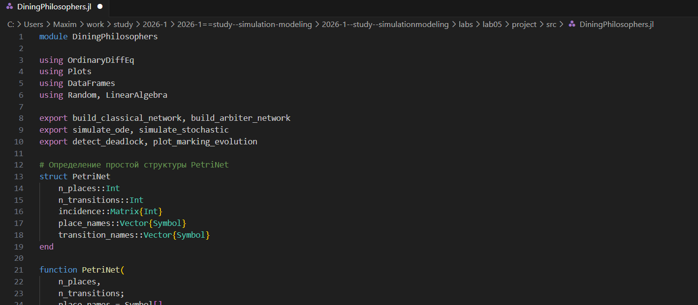{#fig-001 width=70%}

## Базовый эксперимент

Создаем файл с базовым экспериментом, который выполняет основное моделирование и сравнение двух вариантов сети Петри: 
— классическая модель (без арбитра), в которой возможна взаимная блокировка
(deadlock);
— модифицированная модель с арбитром, которая должна предотвращать
deadlock.([рис. @fig-002]).

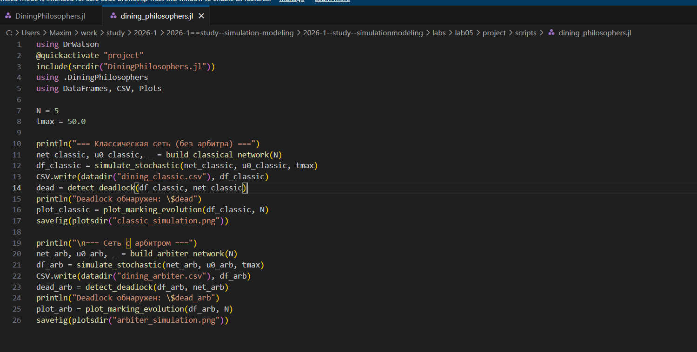{#fig-002 width=70%}

## Базовый эксперимент

Запускаем данный скрипт ([рис. @fig-003]).

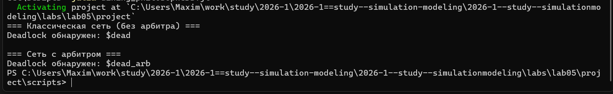{#fig-003 width=70%}

## Базовый эксперимент

Далее создаем все производные форматы([рис. @fig-004]).

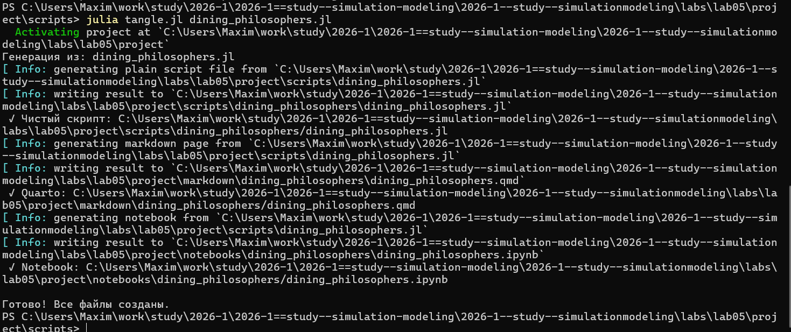{#fig-004 width=70%}

## Базовый эксперимент

Запускаем файл notebook([рис. @fig-005]).

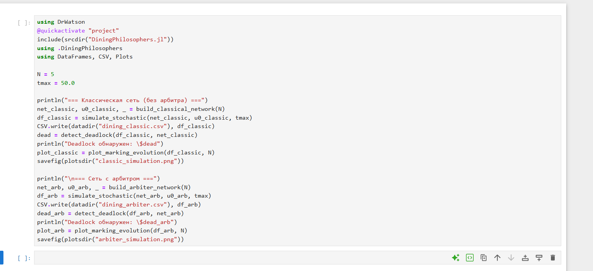{#fig-005 width=70%}

## Базовый эксперимент

В результате получаем следующие графики([рис. @fig-006]).([рис. @fig-007]).

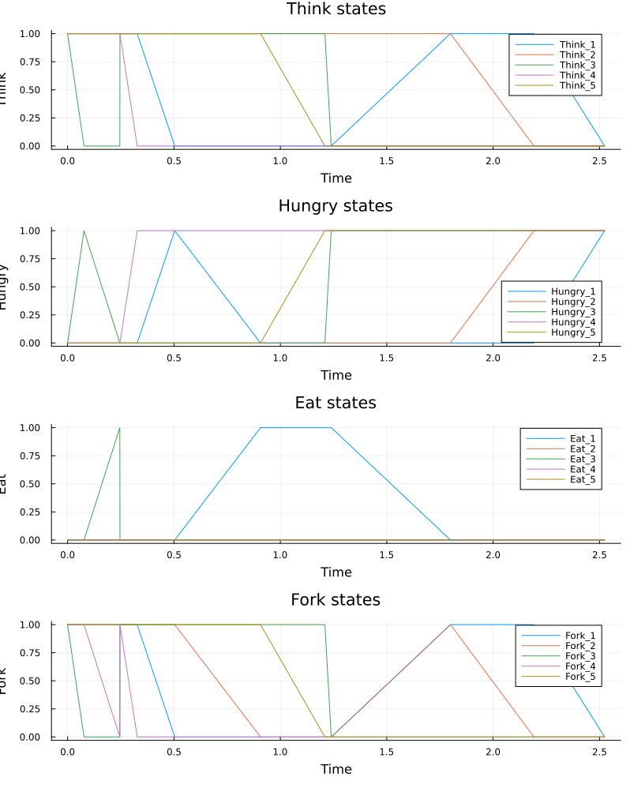{#fig-006 width=70%}

## Базовый эксперимент

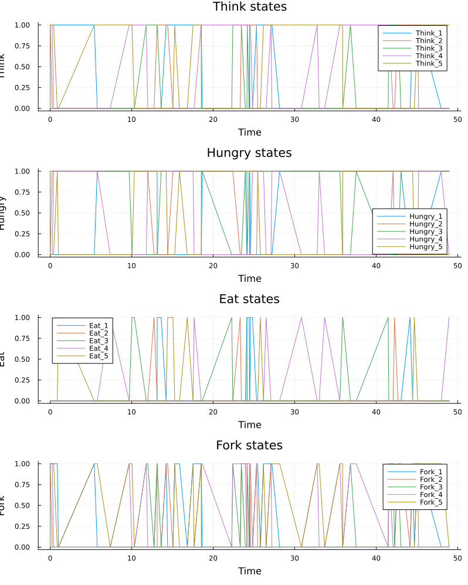{#fig-007 width=70%}

## Анимация процесса

Создаем следующий скрипт, который сделает gif файл с анимацией процесса и наглядно продемпотсрирует динамику работы сети петри([рис. @fig-008]).

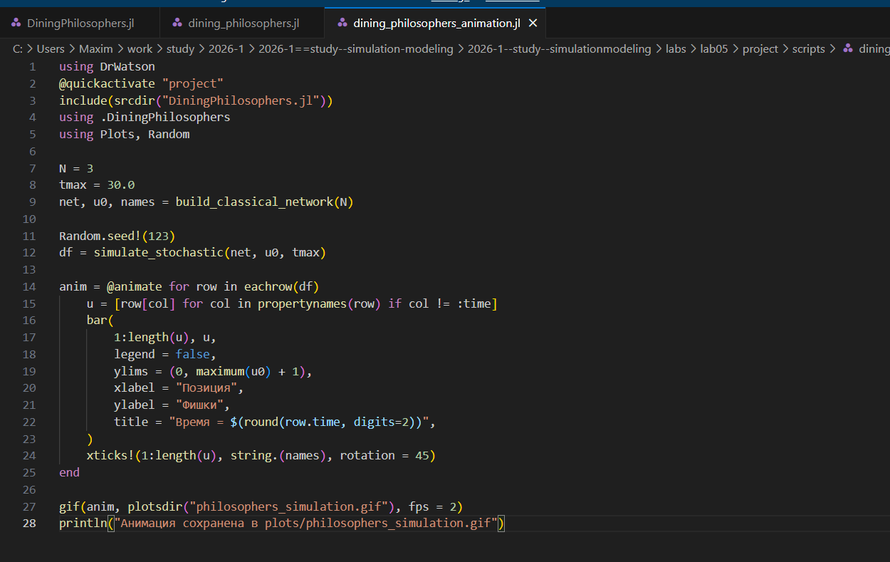{#fig-008 width=70%}

## Анимация процесса

Запускаем и создаем все производные форматы([рис. @fig-009]).

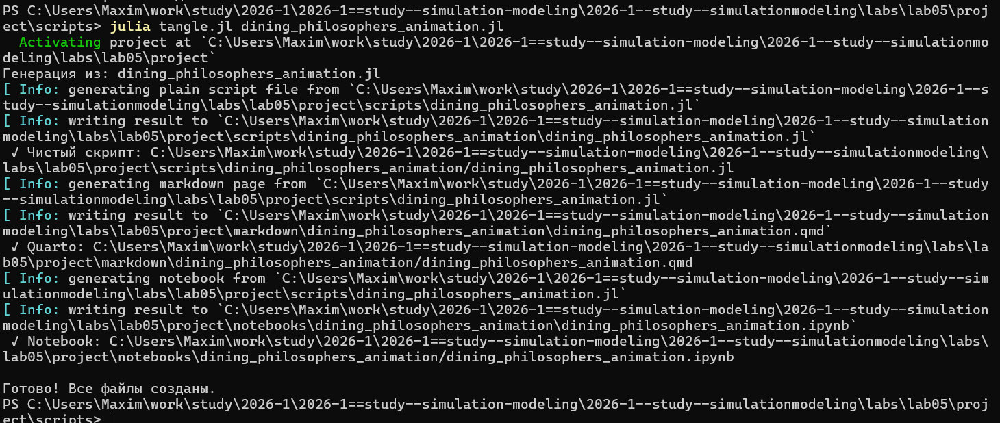{#fig-009 width=70%}

## Анимация процесса

Запускем файл notebook([рис. @fig-010]).

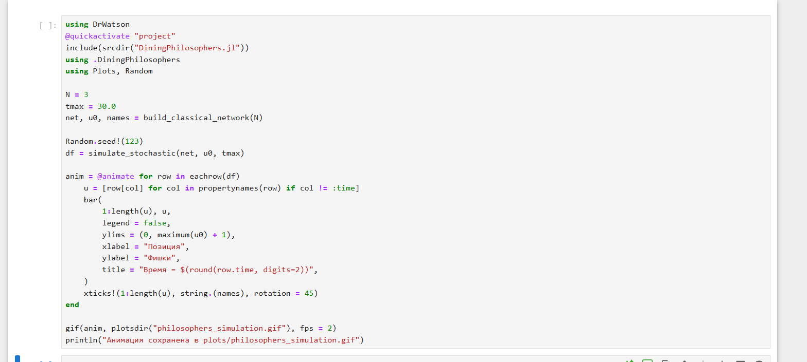{#fig-010 width=70%}

## Итоговый отчет

Создаем и запускаем скрипт для итогового отчета и сравнительного анализа двух моделей([рис. @fig-011]).

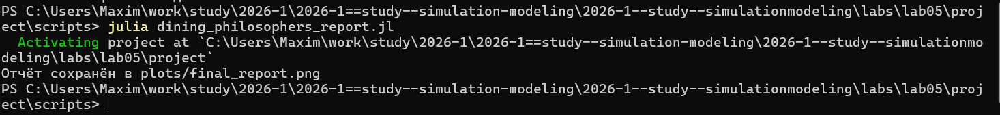{#fig-011 width=70%}

## Итоговый отчет

Создаем все производные форматы([рис. @fig-010]).

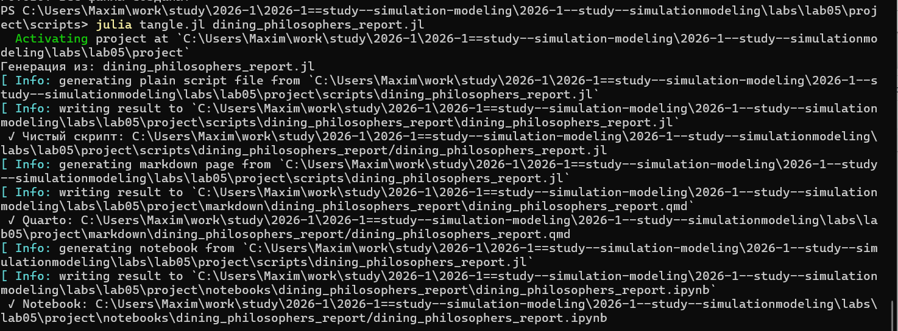{#fig-012 width=70%}

## Итоговый отчет

Запускаем файл notebook([рис. @fig-013]).

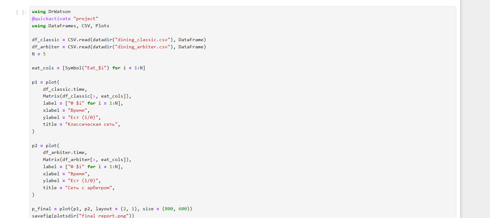{#fig-013 width=70%}

## Итоговый отчет

В результате получаем график ([рис. @fig-014]).

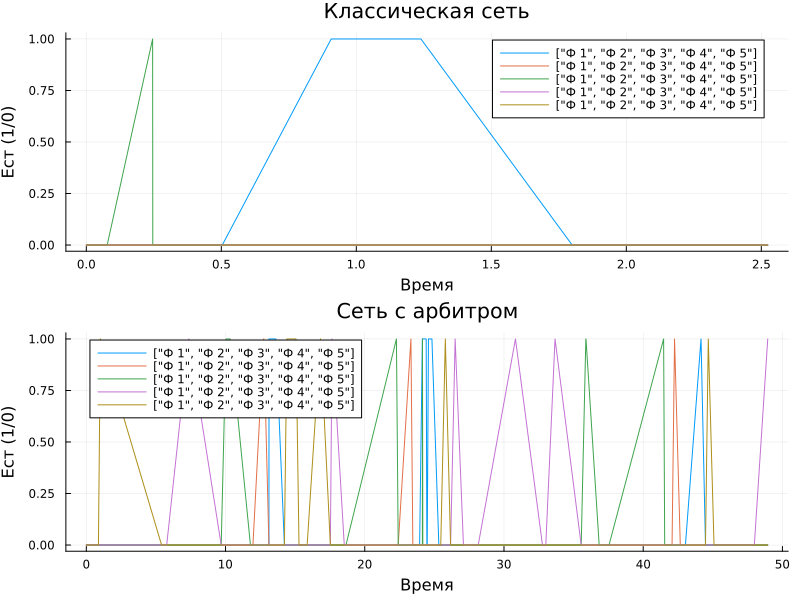{#fig-014 width=70%}

## Выводы

После выполнения данной лабораторной работы мы познакомились с математическим аппаратом Сеть Петри и задачем об обедающих филисофах

## Список литературы{.unnumbered}

::: {#refs}
:::
