---
## Author
author:
  name: Намруев Максим Саналович
  degrees: DSc
  orcid: 0000-0002-0877-7063
  email: 1132236035@pfur.ru
  affiliation:
    - name: Российский университет дружбы народов
      country: Российская Федерация
      postal-code: 117198
      city: Москва
      address: ул. Миклухо-Маклая, д. 6
## Title
title: лабораторная работа №6
subtitle: Имитационное моделирование
license: CC BY
date: today
date-format: "YYYY-MM-DD" # Example: 2025-09-06
---

## Цель работы

Реализовать модель эпидемии SIR с использование сетей Петри

## Задание

— Создать рабочий каталог для кода.
— Установить необходимые пакеты.
— Выполнить предложенный код.
— Преобразовать код в литературный стиль.
— Сгенерировать из литературного кода:
— чистый код;
— jupyter notebook;
— документацию в формате Quarto.
— Выполнить код из jupyter notebook.
— Интегрировать документацию в формате Quarto в отчёт.
— Добавить в код в литературном стиле вычисление для набора параметров.
— Сгенерировать из литературного кода с параметрами:
— чистый код;
— jupyter notebook;
— документацию в формате Quarto.
— Выполнить код из jupyter notebook с параметрами.
— Интегрировать документацию с параметрами в формате Quarto в отчёт.

## Описание модели

— 𝑆 (восприимчивые) — могут заразиться;
— 𝐼 (инфицированные) — заражают других и выздоравливают;
— 𝑅 (выздоровевшие / с иммунитетом) — больше не участвуют в эпидемии.
Сеть Петри содержит два перехода:
— infection: 𝑆 + 𝐼 → 𝐼 + 𝐼 (скорость β);
— recovery: 𝐼 → 𝑅 (скорость γ).

## Построение сети Петри

– Функция: build_sir_network(β, γ)
— Создаёт размеченную сеть Петри (LabelledPetriNet) с двумя переходами:
— infection: S + I → I + I (скорость β)
— recovery: I → R (скорость γ)
— Возвращает:
— объект сети net,
— начальную маркировку u0 = [990.0, 10.0, 0.0],
— имена состояний [:S, :I, :R].

## Детерминированная симуляция

– Функция: simulate_deterministic(net, u0, tspan; saveat, rates)
— Строит систему обыкновенных дифференциальных уравнений (ОДУ) на основе
закона действующих масс.
— Решает её численно с помощью OrdinaryDiffEq (метод Tsit5).
— Возвращает DataFrame с колонками time, S, I, R.

## Стохастическая симуляция

– Файл: simulate_stochastic(net, u0, tspan; rates, rng) - Используется алгоритм Гиллеспи. - Реализует прямой метод Гиллеспи (SSA) для дискретных событий. - На каждом шаге вычисляет пропускные способности:
— a_inf = β * S * I
— a_rec = γ * I
— Случайным образом выбирает, произойдёт ли заражение или выздоровление,
и через какое время.
— Возвращает DataFrame с временами и целочисленными маркировками.

## Вспомогательная функция ОДУ

– Функция: sir_ode(net, rates)
— Возвращает функцию правой части f!(du, u, p, t), которая используется в
simulate_deterministic.
— Сделана отдельно для гибкости.

## Визуализация

– Функция: plot_sir(df)
— Принимает DataFrame с колонками time, S, I, R и строит стандартный график динамики.

## Базовый прогон модели

Выполним один базовый эксперимент с фиксированными параметрами  β = 0.3, γ = 0.1. Запустим два типа симуляции: Детерминированную и стохастическую([рис. @fig-002]).

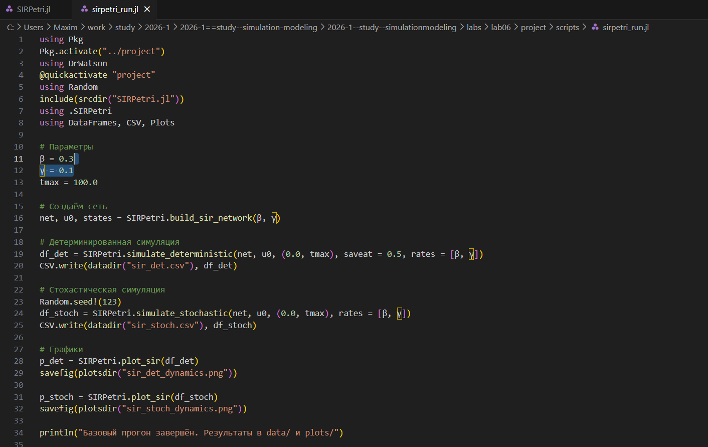{#fig-001 width=70%}

## Базовый прогон модели

Запустим скрипт([рис. @fig-003]).

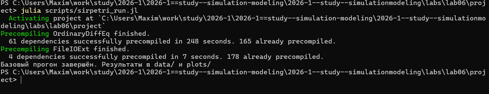{#fig-002 width=70%}

## Базовый прогон модели

Создадим все производные форматы([рис. @fig-004]).

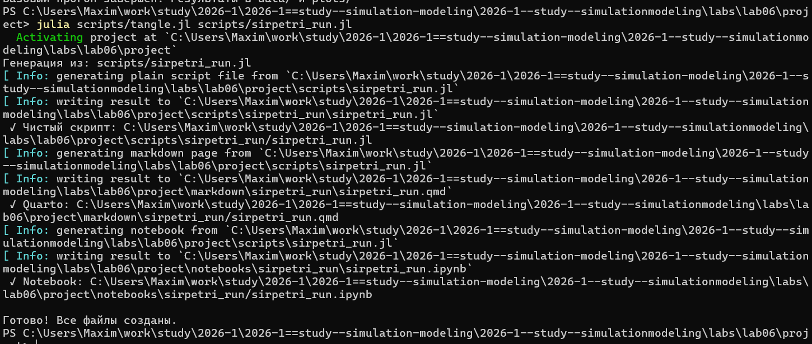{#fig-003 width=70%}

## Базовый прогон модели

Запустим notebook файл([рис. @fig-005]).

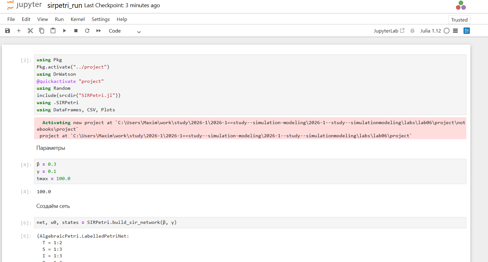{#fig-004 width=70%}

## Базовый прогон модели

В результате получаем слудующие графики([рис. @fig-006]).([рис. @fig-007]).

{#fig-005 width=70%}

## Базовый прогон модели

{#fig-006 width=70%}

## Коэффициент заражения β

Исследуем чувствительность модели к изменению параметра β(скорости заражения)([рис. @fig-007]).

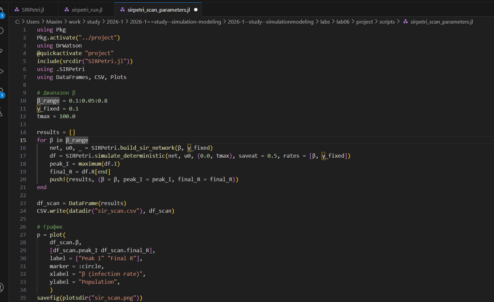{#fig-007 width=70%}

## Коэффициент заражения β

Запустим скрипт([рис. @fig-008]).

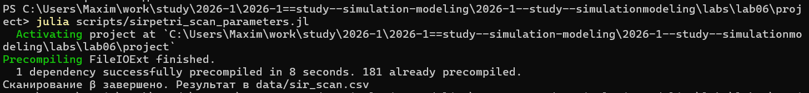{#fig-008 width=70%}

## Коэффициент заражения β

Создадим все производные форматы([рис. @fig-009]).

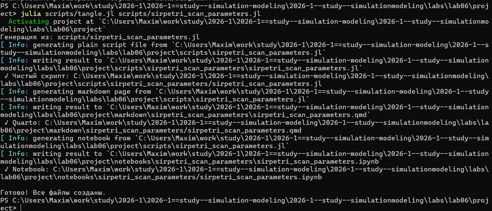{#fig-009 width=70%}

## Коэффициент заражения β

Запустим файл notebook([рис. @fig-010]).

{#fig-010 width=70%}

## Коэффициент заражения β

В результате получим следующий график([рис. @fig-011]).

{#fig-011 width=70%}

## Анимация детерминированной динамики

Создадим GIF-анимацию, показывающую как со временем меняются количество людей в каждой из трех групп([рис. @fig-012]).

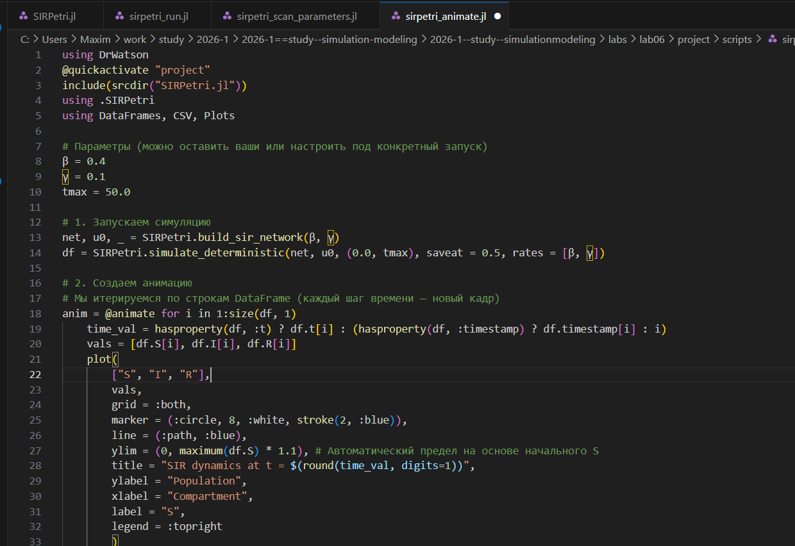{#fig-012 width=70%}

## Анимация детерминированной динамики

Запустим скрипт([рис. @fig-013]).

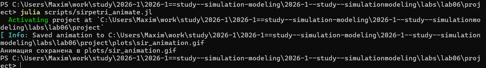{#fig-013 width=70%}

## Анимация детерминированной динамики

Создадим все производные форматы([рис. @fig-014]).

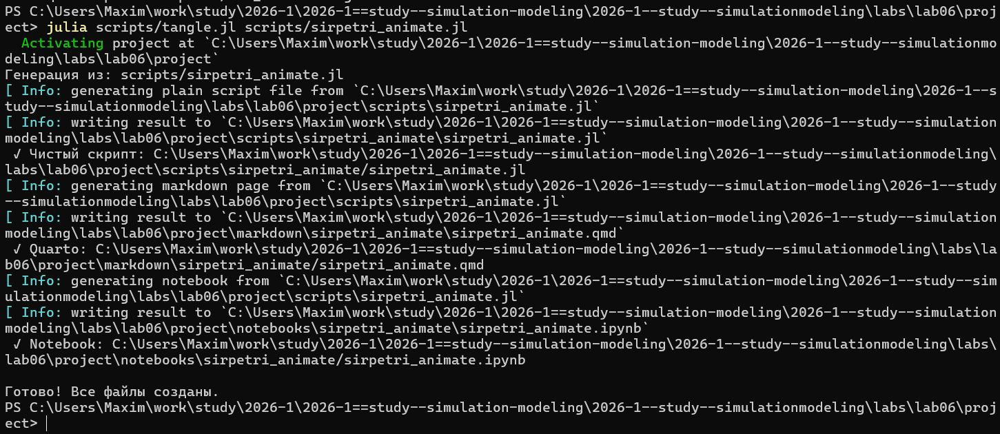{#fig-014 width=70%}

## Анимация детерминированной динамики

Запустим файл notebook([рис. @fig-015]).

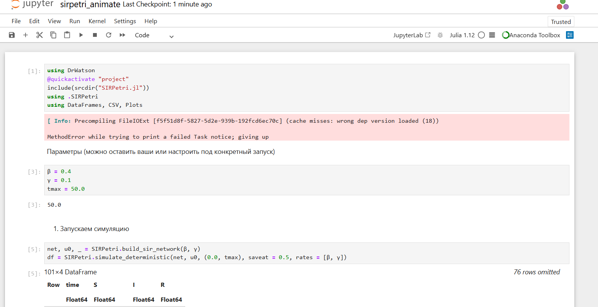{#fig-015 width=70%}

## Итоговый отчет

Загрузим ранее сохраненные результаты и построим сравнительные графики для итогового отчета([рис. @fig-016]).

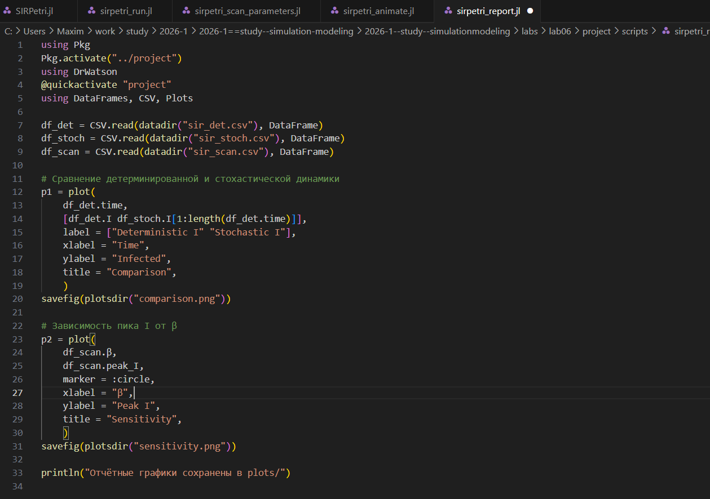{#fig-016 width=70%}

## Итоговый отчет

Запускаем скрипт([рис. @fig-017]).

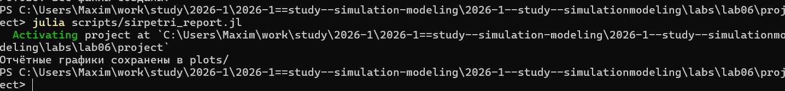{#fig-017 width=70%}

## Итоговый отчет

Создадим все производные форматы([рис. @fig-018]).

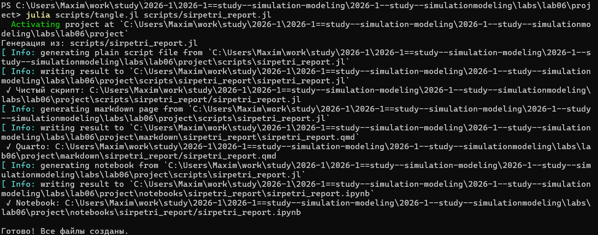{#fig-018 width=70%}

## Итоговый отчет

Запустим файл notebook([рис. @fig-019]).

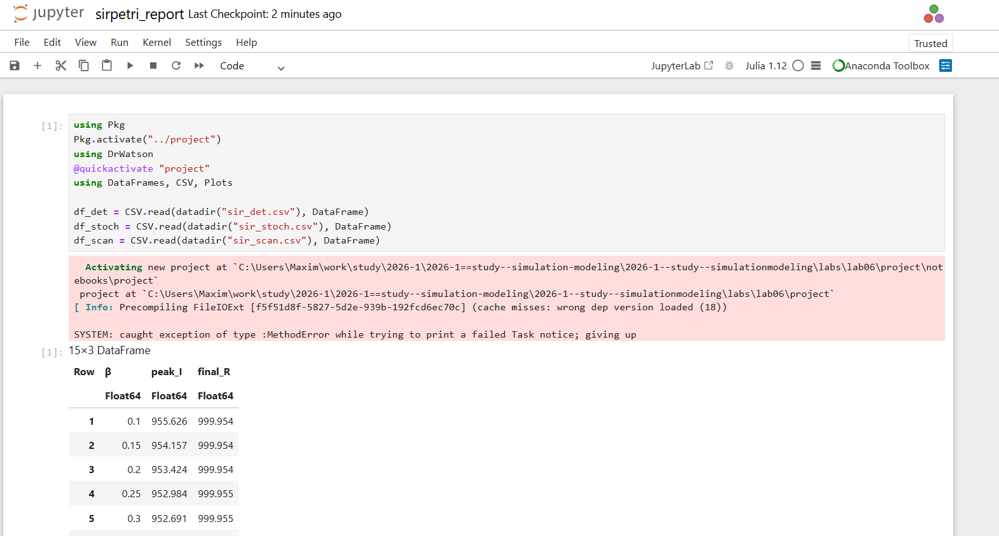{#fig-019 width=70%}

## Итоговый отчет

Получим следующие графики([рис. @fig-020]).([рис. @fig-021]).

{#fig-020 width=70%}

## Итоговый отчет

{#fig-021 width=70%}

## Выводы

После выполнения данной лабораторной работы мы реализовали модели SIR с помощью сетей Петри