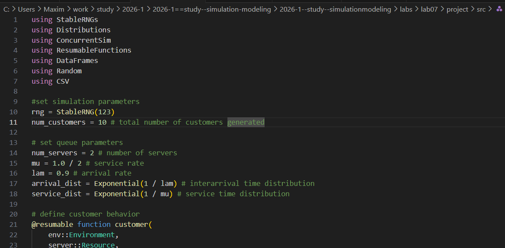
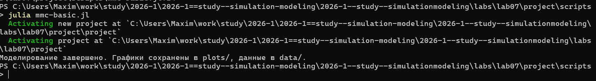
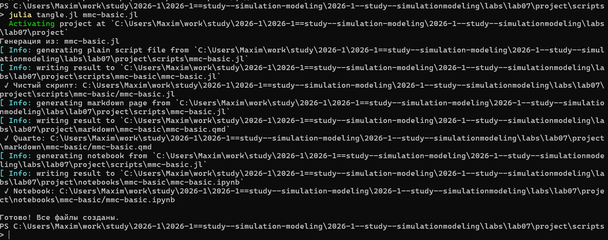
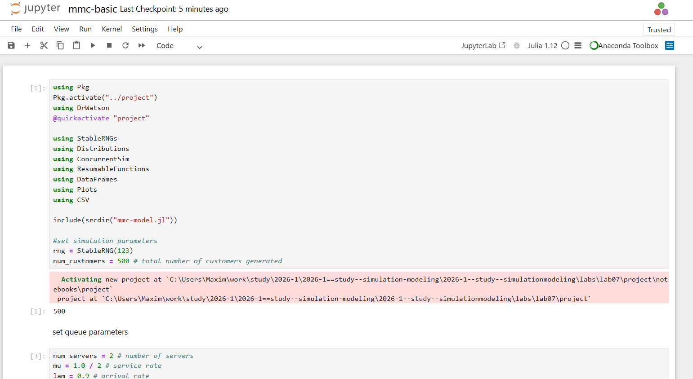
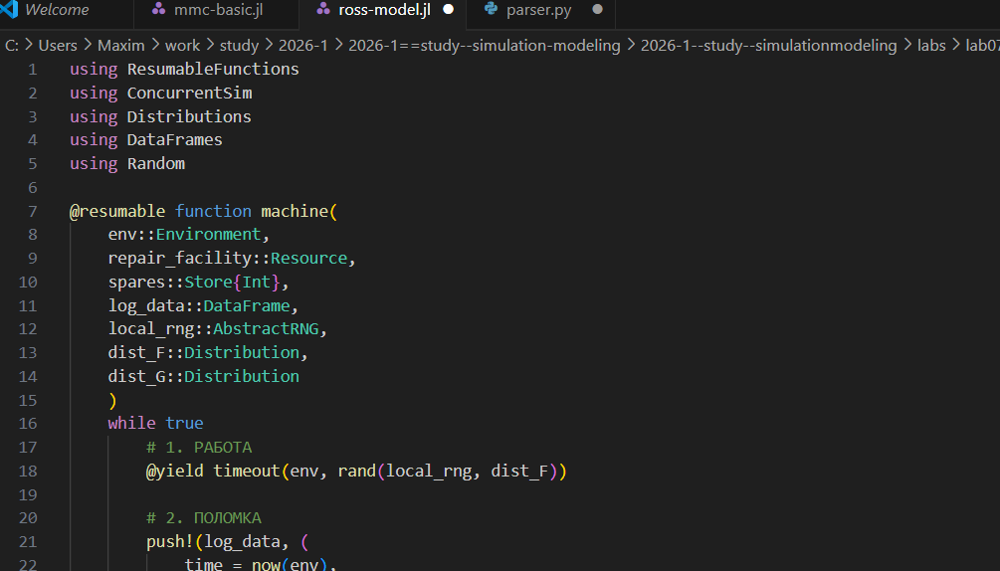
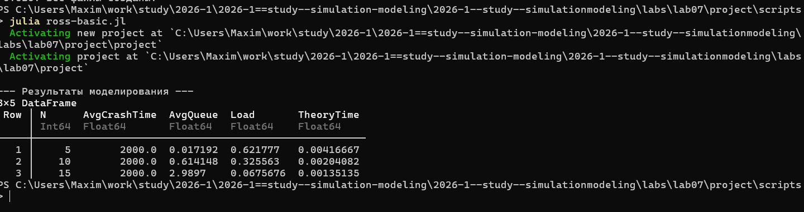
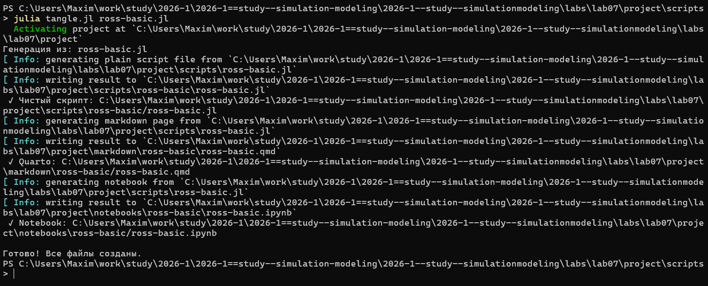
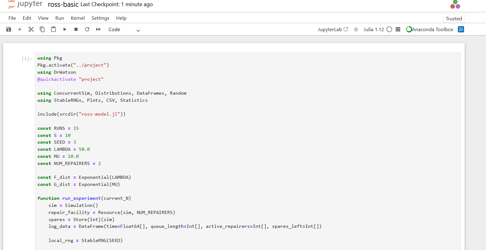
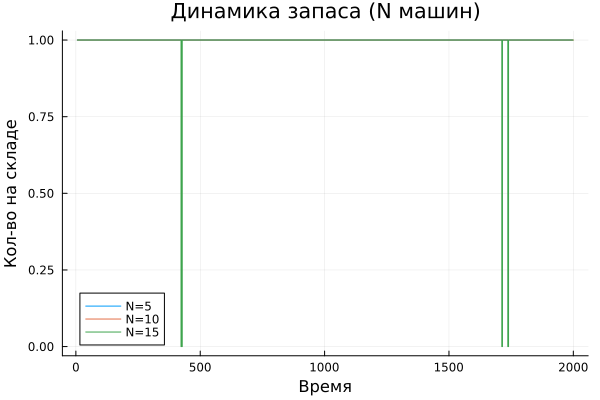

---
## Author
author:
  name: Намруев Максим Саналович
  degrees: DSc
  orcid: 0000-0002-0877-7063
  email: 1132236035@pfur.ru
  affiliation:
    - name: Российский университет дружбы народов
      country: Российская Федерация
      postal-code: 117198
      city: Москва
      address: ул. Миклухо-Маклая, д. 6
## Title
title: лабораторная работа №7
subtitle: Имитационное моделирование
license: CC BY
date: today
date-format: "YYYY-MM-DD" # Example: 2025-09-06
---

## Цель работы

Целью данной лабораторной работы является реализация имитационной
модели Росса (задачи о ремонте оборудования) с использованием дискретнособытийного моделирования и анализ показателей надежности системы при
различных нагрузках

## Задание

— Создать рабочий каталог для кода.
— Установить необходимые пакеты.
— Выполнить предложенный код.
— Преобразовать код в литературный стиль.
— Сгенерировать из литературного кода:
— чистый код;
— jupyter notebook;
— документацию в формате Quarto.
— Выполнить код из jupyter notebook.
— Интегрировать документацию в формате Quarto в отчёт.
— Добавить в код в литературном стиле вычисление для набора параметров.
— Сгенерировать из литературного кода с параметрами:
— чистый код;
— jupyter notebook;
— документацию в формате Quarto.
— Выполнить код из jupyter notebook с параметрами.
— Интегрировать документацию с параметрами в формате Quarto в отчёт.

## Модель М/М/с

Модель M/M/c (по классификации Кендалла) — это система массового обслуживания со следующими свойствами:
— M (Markovian) — входящий поток заявок пуассоновский, интервалы между прибытиями распределены экспоненциально с параметром λ.
— M — время обслуживания каждой заявки распределено экспоненциально с
параметром μ.
— c — количество идентичных обслуживающих приборов (каналов), работающих
параллельно. 

## Модель Росса

Модель представляет собой классический пример системы массового обслуживания с конечной популяцией, резервом и ремонтом.

— В системе находятся 𝑁 идентичных машин, которые постоянно работают и
могут выходить из строя.
— 𝑆 машин находятся в резерве и готовы немедленно заменить любую отказавшую.
— Одно ремонтное устройство (ремонтник), которое может одновременно ремонтировать только одну машину
— Когда работающая машина ломается, происходит следующее:
— Немедленно берётся одна резервная машина (если она есть) и запускается
в работу вместо сломавшейся.
— Сломанная машина отправляется в ремонт.
— Если резерва нет, система падает (crash). Моделирование заканчивается.
— После ремонта машина пополняет пул резервных (становится исправной и
ждёт).
— Требуется оценить среднее время до падения системы 𝐸[𝑇] при заданных
распределениях наработки до отказа и времени ремонта.

## Модель M/M/c

Создаю в папке /src файл с логикой модели ([рис. @fig-001]).

{#fig-001 width=70%}

## Модель M/M/c

Далее создаю и запускаю код с базовым прогоном модели([рис. @fig-002]).

{#fig-002 width=70%}

## Модель M/M/c

Создаю все производные форматы([рис. @fig-003]).

{#fig-003 width=70%}

## Модель M/M/c

Запускаю файл notebook([рис. @fig-004]).

{#fig-004 width=70%}

## Модель Росса

Создаю в папке /src файл с логикой модели Росса([рис. @fig-005]).

{#fig-005 width=70%}

## Модель Росса

Запускаю файл с прогоном модели([рис. @fig-006]).

{#fig-006 width=70%}

## Модель Росса

Создаю все производные форматы([рис. @fig-007]).

{#fig-007 width=70%}

## Модель Росса

Запускаю файл notebook([рис. @fig-008]).

{#fig-008 width=70%}

## Модель Росса

В результате получаю следующий график([рис. @fig-009]).

{#fig-009 width=70%}

## Выводы

В результате выполнения данной лабораторной работы мы научились создавать модель Росса с помощью дискретнособытийного моделирования и анализ показателей надежности системы при различных нагрузках

# Список литературы{.unnumbered}

::: {#refs}
:::
