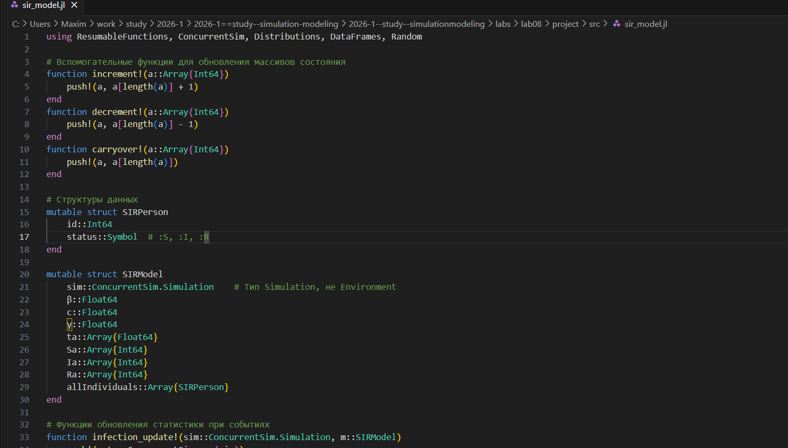
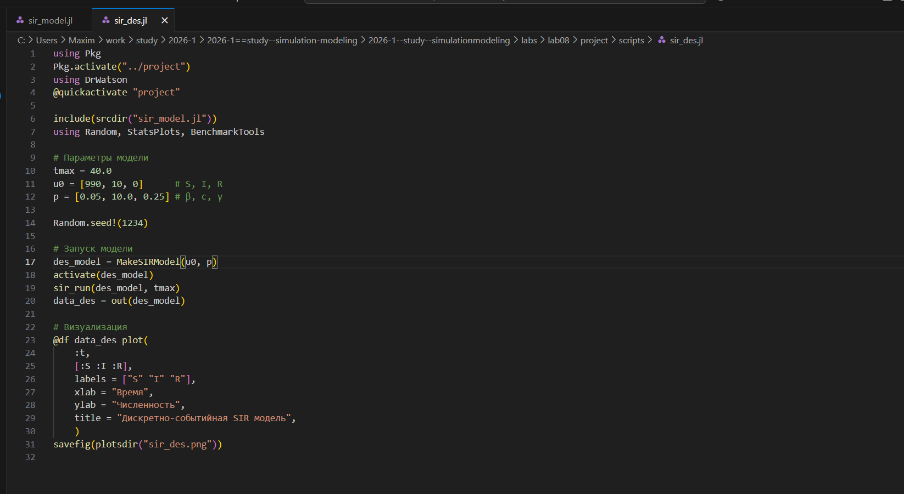
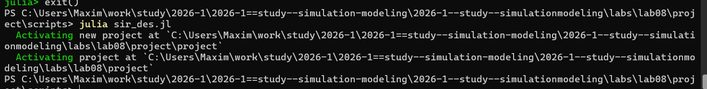
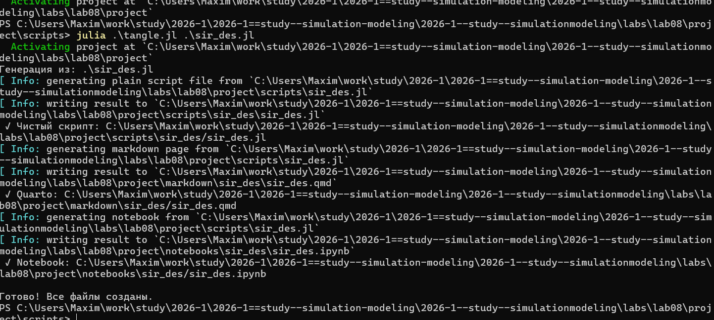
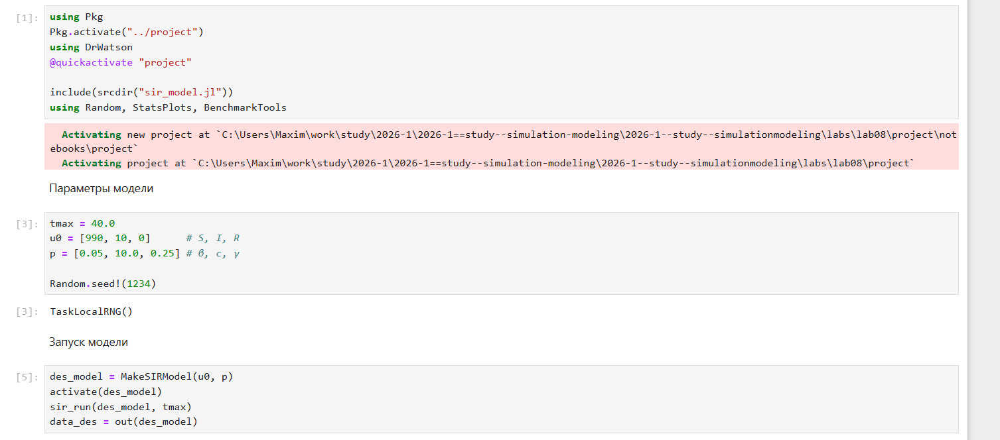
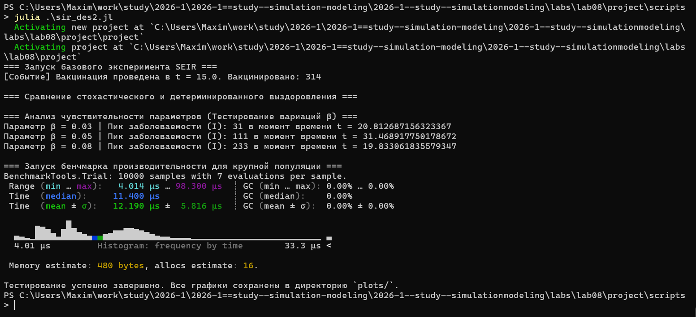
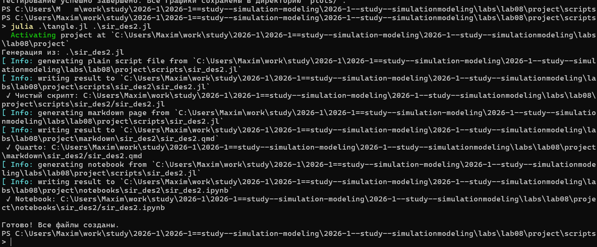
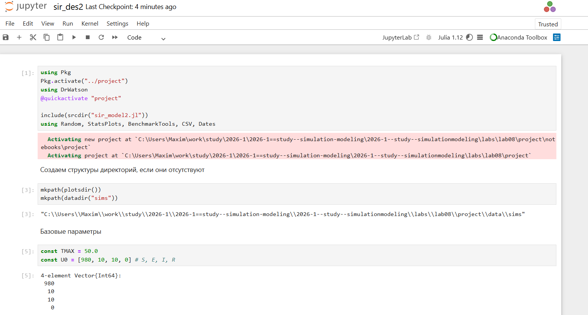
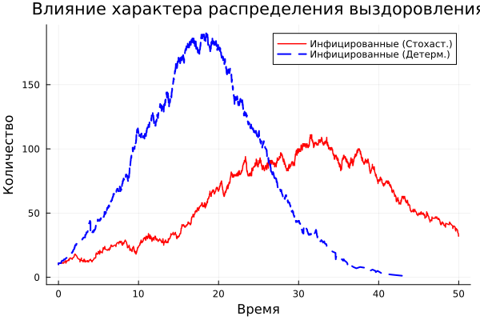

---
## Author
author:
  name: Намруев Максим Саналович
  degrees: DSc
  orcid: 0000-0002-0877-7063
  email: 1132236035@pfur.ru
  affiliation:
    - name: Российский университет дружбы народов
      country: Российская Федерация
      postal-code: 117198
      city: Москва
      address: ул. Миклухо-Маклая, д. 6

## Title
title: "Отчет по лабораторной работе №8"
subtitle: "Имитационное моделирование"
license: "CC BY"
---

# Цель работы

Изучить дискретно-событийный подход к имитационному моделированию на
примере классической модели распространения инфекции SIR. Реализовать стохастическую дискретно-событийную модель в виде программного комплекса на
языке Julia. Провести анализ влияния параметров, сравнить со стохастической и
детерминированной версиями, оценить производительность и модифицировать [@RUDN_ESystem]
модель.

# Задание

— Создать рабочий каталог для кода.
— Установить необходимые пакеты.
— Выполнить предложенный код.
— Преобразовать код в литературный стиль.
— Сгенерировать из литературного кода:
— чистый код;
— jupyter notebook;
— документацию в формате Quarto.
— Выполнить код из jupyter notebook.
— Интегрировать документацию в формате Quarto в отчёт.
— Добавить в код в литературном стиле вычисление для набора параметров.
— Сгенерировать из литературного кода с параметрами:
— чистый код;
— jupyter notebook;
— документацию в формате Quarto.
— Выполнить код из jupyter notebook с параметрами.
— Интегрировать документацию с параметрами в формате Quarto в отчёт

# Теоретическое введение

##Общий алгоритм

Программа моделирует стохастическое распространение инфекции в полностью
смешивающейся популяции конечного размера. В отличие от детерминированной системы ОДУ, здесь наблюдаются случайные флуктуации, а также возможны
ранние вымирания от инфекции при малых начальных I.

- Инициализация: создание объектов индивидов с начальными статусами, инициализация статистических массивов.
— Планирование процессов: для каждого индивида создаётся параллельный
процесс (@process), реализующий его жизненный цикл.
— Запуск симуляции: ConcurrentSim.run продвигает виртуальное время, обрабатывая события в хронологическом порядке. Каждый timeout добавляет событие в календарь; когда время события наступает, выполняется соответствующий код внутри live (возможно, порождая новые события).
— Сбор статистики: в момент изменения состояния индивида обновляются временные ряды Sa, Ia, Ra, а также запоминается текущее время.
— Завершение: по достижении tf симуляция останавливается. Все накопленные
ряды экспортируются в таблицу.
— Постобработка: построение графиков, сохранение результатов.

# Выполнение лабораторной работы

Создаю ядро программы, которое будет исользоваться в основном коде ([рис. @fig-001]).

{#fig-001 width=70%}

Создаю основной код с базовым прогоном модели([рис. @fig-002])

{#fig-002 width=70%}

Запускаю базовый прогон([рис. @fig-003])

{#fig-003 width=70%}

Создаю все производные форматы([рис. @fig-004])

{#fig-004 width=70%}

Запускаю файл notebook([рис. @fig-005])

{#fig-005 width=70%}

В результате получаю следующий график([рис. @fig-006])

{#fig-006 width=70%}



Далее модифицирую код, в котором задаю разные значения для модели и запускаю его([рис. @fig-007])

{#fig-007 width=70%}

Создаю все производные форматы([рис. @fig-008])

{#fig-008 width=70%}

Запускаю файл notebook([рис. @fig-009])

{#fig-009 width=70%}

В результате получаю следующие графики([рис. @fig-010])([рис. @fig-011])([рис. @fig-012])

{#fig-010 width=70%}

{#fig-011 width=70%}

{#fig-012 width=70%}



# Выводы

После выполнения данной лабораторной работы мы изучили дискретно-событийный подход к имитационному моделированию на примере классической модели распространения инфекции SIR

# Список литературы{.unnumbered}

::: {#refs}
:::
